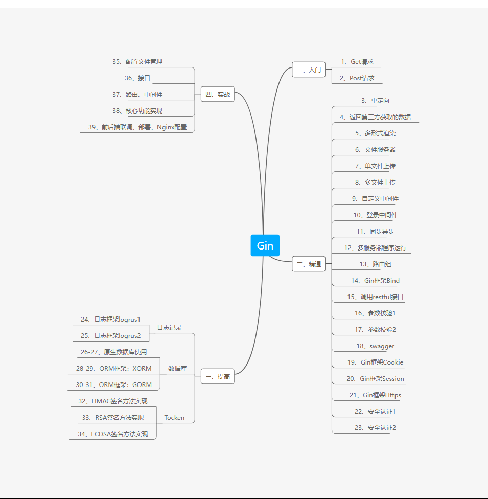

# Gin自学笔记

官方是怎么描述Gin框架的

- Go语言最快的全功能Web框架。晶莹剔透。

- Gin是一个使用Go语言开发的Web框架。

- 它提供类似Martini的API，但性能更佳，速度提升高达40倍。

- 如果你是性能和高效的追求者, 你会爱上 Gin。


## 总体学习流程



## 一、Get 请求

HTTP 是超文本传输协议。

其定义了客户端和服务端之间文本传输的规范。


### Get 方法

Get 方法：主要用于从指定资源中请求数据。

使用 Get 方法的请求应该是只是检索数据，并且不应对数据产生其它影响。

### Gin 如何实现 Http 的Get 方法

#### 准备工作

##### 1、下载并且安装 Gin

```bash
go get -u github.com/gin-gonic/gin
```

##### 2、将 Gin 导入代码中

```go
import "github.com/gin-gonic/gin"
import "net/http"
```

#### 核心代码

```go
r := gin.Default() // 获取路由引擎
r.GET()            // 执行 HTTP 协议的 Get 请求
```

##### 关于 Get 的一些问题

安全性：因 Get 请求的不安全性，在处理敏感数据时，绝不可以使用 Get 请求，因为数据在URL中对所有人都是可见的。

数据长度：当发送数据时，Get 方法向 URL 添加数据源；URL 的长度是受限制的（ URL 的最大长度是 2048 个字符）。

因此需用到下面说到的Post方法

## 二、  Post 方法

### 引入 Post 方法

1. Post 方法用于将数据发送到服务器以创建或跟新资源
2. Post 比 Get 更安全
3. 对于数据长度没有限制

在客户机和服务器之间进行请求 - 响应时，两种最常用的方法就是：`Get` 和 `Post`

Get - 从指定的资源请求数据

Post - 向指定的资源提交要被处理的数据

最直观的区别就是 Get 把参数包含在 URL 中，Post 通过request body 传递参数

### Gin 如何使用 Post 请求

#### 核心代码

```go
r := gin.Default()
r.Post()
```

## 三、重定向

将指定的网络请求重写定个方向，使其跳转到指定的其它位置(网站)

通过重定向来完成网页、网址的自动跳转

可分为：一般重定向 与 路由重定向

#### 核心代码

```go
// 重定向
// 一般重定向：重定向到外部网络
	r.GET("/redirect1", func(c *gin.Context) {
		// 重定向到本人 GitHub 首页，获取到 GitHub 本人首页的数据
		// 重定向状态码：StatusMovedPermanently
		url := "https://github.com/zhang-qilin"
		c.Redirect(http.StatusMovedPermanently,url)
	})


// Gin 路由重定向，使用如下的HandleContex
// 路由重定向：重定向到具体的路由
	r.GET("/redirect2", func(c *gin.Context) {
		c.Request.URL.Path="/TestRedirect"
		r.HandleContext(c)
	})
	// 路由：http://localhost:9090/TestRedirect
	r.GET("/TestRedirect", func(c *gin.Context) {
		c.JSON(http.StatusOK,gin.H{
			"code":http.StatusOK,
			"msg":"响应成功",
		})
	})
```


## 四、返回第三方获取的数据

在我们自己开发的 Server 程序时，Client 请求时需要获取第三方网站上的数据并且将其放回。

#### 核心代码

```go
// 请求第三方数据
reponse, err := http.Get(url)

// 获取响应体
body := response.Body

// 数据返回 Clien
c.DataFromReader(http.StatusOK, contenLength, contentType, body, extraHeaders)

```


