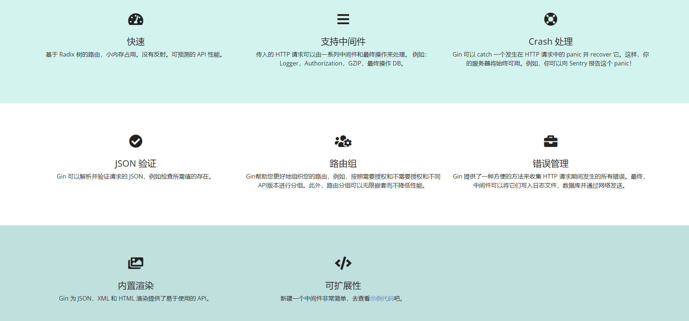

# Gin自学笔记

官方是怎么描述Gin框架的

- Go语言最快的全功能Web框架。晶莹剔透。

- Gin是一个使用Go语言开发的Web框架。

- 它提供类似Martini的API，但性能更佳，速度提升高达40倍。

- 如果你是性能和高效的追求者, 你会爱上 Gin。



## 总体学习流程


## 一、Get 请求

HTTP 是超文本传输协议。

其定义了客户端和服务端之间文本传输的规范。


### Get 方法

Get 方法：主要用于从指定资源中请求数据。

使用 Get 方法的请求应该是只是检索数据，并且不应对数据产生其它影响。

### Gin 如何实现 Http 的Get 方法

#### 准备工作

##### 1、下载并且安装 Gin

```bash
go get -u github.com/gin-gonic/gin
```

##### 2、将 Gin 导入代码中

```go
import "github.com/gin-gonic/gin"
import "net/http"
```

#### 核心代码

```go
r := gin.Default() // 获取路由引擎
r.GET()            // 执行 HTTP 协议的 Get 请求
```

##### 关于 Get 的一些问题

安全性：因 Get 请求的不安全性，在处理敏感数据时，绝不可以使用 Get 请求，因为数据在URL中对所有人都是可见的。

数据长度：当发送数据时，Get 方法向 URL 添加数据源；URL 的长度是受限制的（ URL 的最大长度是 2048 个字符）。

因此需用到下面说到的Post方法

## 二、  Post 方法

### 引入 Post 方法

1. Post 方法用于将数据发送到服务器以创建或跟新资源
2. Post 比 Get 更安全
3. 对于数据长度没有限制

在客户机和服务器之间进行请求 - 响应时，两种最常用的方法就是：`Get` 和 `Post`

Get - 从指定的资源请求数据

Post - 向指定的资源提交要被处理的数据

最直观的区别就是 Get 把参数包含在 URL 中，Post 通过request body 传递参数

### Gin 如何使用 Post 请求

#### 核心代码

```go
r := gin.Default()
r.Post()
```

## 三、重定向

将指定的网络请求重写定个方向，使其跳转到指定的其它位置(网站)

通过重定向来完成网页、网址的自动跳转

可分为：一般重定向 与 路由重定向

#### 核心代码

```go
// 重定向
// 一般重定向：重定向到外部网络
	r.GET("/redirect1", func(c *gin.Context) {
		// 重定向到本人 GitHub 首页，获取到 GitHub 本人首页的数据
		// 重定向状态码：StatusMovedPermanently
		url := "https://github.com/zhang-qilin"
		c.Redirect(http.StatusMovedPermanently,url)
	})


// Gin 路由重定向，使用如下的HandleContex
// 路由重定向：重定向到具体的路由
	r.GET("/redirect2", func(c *gin.Context) {
		c.Request.URL.Path="/TestRedirect"
		r.HandleContext(c)
	})
	// 路由：http://localhost:9090/TestRedirect
	r.GET("/TestRedirect", func(c *gin.Context) {
		c.JSON(http.StatusOK,gin.H{
			"code":http.StatusOK,
			"msg":"响应成功",
		})
	})
```

Demo

```go
/*
* @Time ： 2022-12-12 23:03
* @Auth ： 张齐林
* @File ：Redirection.go
* @IDE ：GoLand
 */
package main

import (
	"net/http"
	
	"github.com/gin-gonic/gin"
)

func main() {
	r := gin.Default()
	
	// 一般重定向：重定向到外部网络
	r.GET("/redirect1", func(c *gin.Context) {
		// 重定向到本人 GitHub 首页，获取到 GitHub 本人首页的数据
		// 重定向状态码：StatusMovedPermanently
		url := "https://github.com/zhang-qilin"
		c.Redirect(http.StatusMovedPermanently,url)
	})
	
	// 路由重定向：重定向到具体的路由
	r.GET("/redirect2", func(c *gin.Context) {
		c.Request.URL.Path="/TestRedirect"
		r.HandleContext(c)
	})
	// 路由：http://localhost:9090/TestRedirect
	r.GET("/TestRedirect", func(c *gin.Context) {
		c.JSON(http.StatusOK,gin.H{
			"code":http.StatusOK,
			"msg":"响应成功",
		})
	})
	r.Run(":9090")
}

```


## 四、返回第三方获取的数据

在我们自己开发的 Server 程序时，Client 请求时需要获取第三方网站上的数据并且将其放回。

#### 核心代码

```go
// 请求第三方数据
reponse, err := http.Get(url)

// 获取响应体
body := response.Body

// 数据返回 Clien
c.DataFromReader(http.StatusOK, contenLength, contentType, body, extraHeaders)

```

Deme

```go
/*
* @Time ： 2022-12-12 23:03
* @Auth ： 张齐林
* @File ：Redirection.go
* @IDE ：GoLand
 */
package main

import (
	"net/http"
	
	"github.com/gin-gonic/gin"
)

func main() {
	r := gin.Default()
	
	r.GET("/GetOtherData", func(c *gin.Context) {
		// url:="https://www.baidu.com"
		url:="https://avatars.githubusercontent.com/u/53826118?v=4"
		response, err := http.Get(url)
		if err != nil || response.StatusCode!= http.StatusOK{
			c.Status(http.StatusServiceUnavailable)  // 应答 Client
			return 
		}
		body := response.Body
		contentLength := response.ContentLength
		contentType := response.Header.Get("Content-Type")
		// 数据写入响应体
		c.DataFromReader(http.StatusOK,contentLength,contentType,body,nil)
	})
	
	r.Run(":9090")
}

```

## 五、多形式渲染

Server 返回 Client 的数据，需要使用到 `Json` 、`HTML`、`XML`  `YAML` 等多种形式 

#### 核心代码

```go
// 返回 JSON
c.JSON(http.StatusOK,gin.H{"html":"<b>Hello Gin</b>"})

// 返回输出 HTML
c.PureJSON(http.StatusOK,gin.H{"html":"<b>Hello Gin</b>"})

// 返回 YAML 形式(YAML 渲染)
c.YAML(http.StatusOK,gin.H{"message":"hey","status":http.StatusOK})

// 输出 XML 形式
c.XML(http.StatusOK,data)
```

Demo

```go
/*
* @Time ： 2022-12-12 23:03
* @Auth ： 张齐林
* @File ：Redirection.go
* @IDE ：GoLand
 */
package main

import (
	"net/http"
	
	"github.com/gin-gonic/gin"
)

func main() {
	r := gin.Default()
	
	// JSON 格式输出
	r.GET("/json", func(c *gin.Context) {
		
		c.JSON(http.StatusOK,gin.H{
			"html":"<b>Hello Gin</b>",
		})
		
	})
	// HTML 格式输出
	r.GET("/someHTML", func(c *gin.Context) {
		c.PureJSON(http.StatusOK,gin.H{
			"html":"<b>Hello Gin</b>",
		})
	})
	
	// XML 格式输出(XML 渲染)
	r.GET("/someXML", func(c *gin.Context) {
		type Message struct {
			Name string
			Msg string
			Age int
		}
		info := Message{
			Name: "张齐林",
			Msg:  "Hello",
			Age:  88,
		}
		c.XML(http.StatusOK,info)
	})
	
	// YAML 格式输出(YAML 渲染)
	r.GET("/someYAML", func(c  *gin.Context) {
		c.YAML(http.StatusOK,gin.H{
			"message":"Gin 框架的多形式渲染",
			"status":http.StatusOK,
		})
	})
	
	r.Run(":9090")
}
```

## 六、文件服务器

Clien 请求的内容是`视频`、`音频`、`图片` 等文件

Gin 框架提供了快速搭建文件服务

#### 核心代码

```go
func(c *gin.Context) {
		path := "File_Path"
		fileName := path+c.Query("name")
		c.File(fileName)
}
```

Demo

```go
/*
* @Time ： 2022-12-15 23:51
* @Auth ： 张齐林
* @File ：File_service.go
* @IDE ：GoLand
 */
package main

import "github.com/gin-gonic/gin"

func main() {
	r := gin.Default()
	r.GET("/file", fileServer)
	r.Run(":9090")
}

func fileServer(c *gin.Context) {
	path := "D:/种子/github.com/gin-demo/"
	fileName := path + c.Query("name")
	c.File(fileName)
}
```

## 七、单文件上传

#### 核心代码

```go
file,_ := c.FormFile("file")
// 文件对应的 Key (Post 方法)
c.SaveUploadedFile(file,dst + file.Filename)
// 存储文件
c.String(http.StatusOK,fmt.Sprintf("'%s' 上传完成...",file.Filename))
```

Demo

```go
/*
* @Time ： 2022-12-16 0:12
* @Auth ： 张齐林
* @File ：Uploading_a_Single_File.go
* @IDE ：GoLand
 */
package main

import (
	"fmt"
	"log"
	"net/http"
	
	"github.com/gin-gonic/gin"
)

func main() {
	r := gin.Default()
	r.POST("/upload", func(c *gin.Context) {
		file, err := c.FormFile("fileName")
		if err != nil {
			c.String(http.StatusBadRequest,"文件上传错误")
		}
		// 定义服务端要把客户端上传的文件保存到上面路径下(存储路径)
		dst :="D:/种子/github.com/gin-demo/"
		// 存储文件
		c.SaveUploadedFile(file,dst+file.Filename)
		c.String(http.StatusOK,fmt.Sprintf("%s 上传成功",file.Filename))
		
	})
	err := r.Run()
	if err != nil {
		log.Fatalf("err: %s.\n", err)
		return
	}
}
```


## 八、多文件上传

#### 核心代码

```go
form, err := c.MultipartForm()
		if err != nil {
			log.Fatalln(err)
		}
		files := form.File["file_key"]
		for _, file := range files{
			c.SaveUploadedFile(file,dst + file.Filename)
			fmt.Printf("文件 %s 上传成功...\n", file.Filename)
		}
				c.String(http.StatusOK,fmt.Sprintf("%d files uploaded...",len(files)))
```

Demo

```go
/*
* @Time ： 2022-12-16 23:22
* @Auth ： 张齐林
* @File ：Uploading_Multiple_Files.go
* @IDE ：GoLand
 */
package main

import (
	"log"
	"net/http"
	
	"github.com/gin-gonic/gin"
)

func main() {
	r := gin.Default()
	
	// c.Request.ParseMultipartForm()并不能限制上传文件的大小，只是限制了上传的文件读取到内存部分的大小，如果超过了就存入了系统的临时文件中。
	// 如果需要限制文件大小，需要使用github.com/gin-contrib/size中间件，如demo中使用r.Use(limits.RequestSizeLimiter(4 << 20))限制最大4Mb。
	r.MaxMultipartMemory= 8 << 20   // 8 MB
	r.POST("/upload", func(c *gin.Context) {
		form, err := c.MultipartForm()  //  获取form
		if err != nil {
			c.String(http.StatusBadRequest,"文件上传错误：%s",err)
		}
		files := form.File["file_key"]  // 上传的所有文件
		
		// 定义文件上传后存放的位置
		dst :="D:/种子/github.com/gin-demo/"
		
		// 遍历所有文件
		for _, file :=range files{
			c.SaveUploadedFile(file,dst + file.Filename)
		}
		c.String(http.StatusOK,"%d 个文件上传成功...",len(files))
	})
	
	err := r.Run()
	if err != nil {
		log.Println(err)
		return
	}
}
```

## 九、自定义中间件

Client 请求的路由数据进行预处理（数据加载、请求验证(过滤)等 …）

**中间件里面有错误如果不想继续后续接口的调用不能直接`return`，而是应该调用`c.Abort()`方法。**

源码如下：

```go
// Abort prevents pending handlers from being called. Note that this will not stop the current handler.
// Let's say you have an authorization middleware that validates that the current request is authorized.
// If the authorization fails (ex: the password does not match), call Abort to ensure the remaining handlers
// for this request are not called.
func (c *Context) Abort() {
	c.index = abortIndex
}
```

核心代码

```go
r ：=gin.New()
r.Use(Middleware)  // 使用中间件
r.Get()
// 自定义路由中间件
func Middleware()gin.HandlerFunc {
	return func(c *gin.Context) {
		
}
```

Demo

```go
/*
* @Time ： 2022-12-17 0:14
* @Auth ： 张齐林
* @File ：Custom_middleware.go
* @IDE ：GoLand
 */
package main

import (
	"fmt"
	"log"
	"net/http"
	"strconv"
	
	"github.com/gin-gonic/gin"
)

func main() {
	r := gin.Default()
	// 如果需要用到没有任何中间件的路由引擎时可以使用以下的 gin.New() 方法
	// r:=gin.New()
	r.Use(Midleware())  // 使用User的话是属于全局中间件的定义使用，如果只需要当单独的方法使用中间件的话(也就是说局部中间件)，直接在方法后面的路由添加即可，如下
	// r.GET("/middleware",Midleware(), func(c *gin.Context) {
	r.GET("/middleware", func(c *gin.Context) {
	fmt.Println("服务端开始执行...")
		
		name := c.Query("name")
		ageStr := c.Query("age")
		age, _ := strconv.Atoi(ageStr)
		log.Println(name, age)
		
		res := struct {
			Name string `json:"name"`
			Age int `json:"age"`
		}{name,age,}
		c.JSON(http.StatusOK,res)
		
	})
	
	r.Run()
}

func Midleware() gin.HandlerFunc {
	return func(c *gin.Context) {
		fmt.Println("中间件开始执行...")
		name := c.Query("name")
		ageStr := c.Query("age")
		age, err := strconv.Atoi(ageStr)
		if err != nil {
			c.AbortWithStatusJSON(http.StatusBadRequest,"用户数据的数据有错误，age 的值不是整数")
			
			// Abort prevents pending handlers from being called. Note that this will not stop the current handler.
			// Let's say you have an authorization middleware that validates that the current request is authorized.
			// If the authorization fails (ex: the password does not match), call Abort to ensure the remaining handlers
			// for this request are not called.
			c.Abort()
			return
		}
		if age <0 || age> 100{
			c.AbortWithStatusJSON(http.StatusBadRequest,"用户数据的数据有错误，age 的值不是整数")
			c.Abort()
			return
		}
		if len(name) <6 || len(name) >12{
			c.AbortWithStatusJSON(http.StatusBadRequest,"用户名只能是6-12位数")
			c.Abort()
			return
		}
		// 执行后续的操作
		c.Next()
		fmt.Println(name, age)
	}
}
```

十、登录中间件

快速实现登录验证中间件方法

Gin 框架提供了快速登录验证中间件，可以完成登录的验证

#### 核心代码

```go
accounts := gin.Accounts{ // gin.Account是map[string]string 类型
		"admin": "adminpw",
	}
// 动态添加用户
accounts["Golang"] = "123654"
accounts["Gin"] = "789abc"
auth := gin.BasicAuth(accounts)
```

Demo

```go
/*
* @Time ： 2022-12-18 23:58
* @Auth ： 张齐林
* @File ：Login_middleware.go
* @IDE ：GoLand
 */
package main

import (
	"log"
	"net/http"
	
	"github.com/gin-gonic/gin"
)

func main() {
	r := gin.Default()

	r.Use(AuthMiddleware())
	
	r.GET("/login", func(context *gin.Context) {
		// 获取用户，它是由 BasicAuth 中间件设置的
		user:= context.MustGet(gin.AuthUserKey).(string)
		context.JSON(http.StatusOK,"登录成功..." + "欢迎您: " + user)
	})
	
	err := r.Run()
	if err != nil {
		log.Println(err)
		return
	}
}

func AuthMiddleware() gin.HandlerFunc {
	// 初始化用户
	accounts := gin.Accounts{ // gin.Accounts 是 map[string]string
		"admin":"adminpw",
		"system":"systempw",
	}
	
	// 动态添加用户
	accounts["root"]="rootpw"
	
	// 将用户添加到登录中间件中
	auth := gin.BasicAuth(accounts)
	return auth
}
```


## 十、登录中间件

快速实现登录验证中间件方法

Gin 框架提供了快速登录验证中间件，可以完成登录的验证

#### 核心代码

```go
accounts := gin.Accounts{ // gin.Account是map[string]string 类型
		"admin": "adminpw",
	}
// 动态添加用户
accounts["Golang"] = "123654"
accounts["Gin"] = "789abc"
auth := gin.BasicAuth(accounts)
```

Demo

```go
/*
* @Time ： 2022-12-18 23:58
* @Auth ： 张齐林
* @File ：Login_middleware.go
* @IDE ：GoLand
 */
package main

import (
	"log"
	"net/http"
	
	"github.com/gin-gonic/gin"
)

func main() {
	r := gin.Default()

	r.Use(AuthMiddleware())
	
	r.GET("/login", func(context *gin.Context) {
		// 获取用户，它是由 BasicAuth 中间件设置的
		user:= context.MustGet(gin.AuthUserKey).(string)
		context.JSON(http.StatusOK,"登录成功..." + "欢迎您: " + user)
	})
	
	err := r.Run()
	if err != nil {
		log.Println(err)
		return
	}
}

func AuthMiddleware() gin.HandlerFunc {
	// 初始化用户
	accounts := gin.Accounts{ // gin.Accounts 是 map[string]string
		"admin":"adminpw",
		"system":"systempw",
	}
	
	// 动态添加用户
	accounts["root"]="rootpw"
	
	// 将用户添加到登录中间件中
	auth := gin.BasicAuth(accounts)
	return auth
}
```

## 十一、同步异步

`同步方法`：调用一旦开始，调用者必须等到方法调用返回后，才能继续后续的行为。

`异步方法`：调用更像一个消息队列，一旦开始，方法调用就会立即返回，调用者就可以继续后面的操作，而异步操作通常会在另一个 Go 程（Goroutine）过程，不会障碍调用者的工作。

可以在中间件或处理程序中启动新的Go程（Goroutines）

**特别注意：需要使用上下文的副本**

#### 核心代码

```go
for j:=0;j<6;j++ {
    go func(i int) { // TODO：创建的Go程
        // 创建要在 goroutine 中使用的副本
        cCp := c.Copy()
        time.Sleep(time.Duration(i) * time.Second)
        // 这里使用创建的副本（保证不相互影响）
        fmt.Println("第" + strconv.Itoa(i) + "个Go程: " + cCp.Request.URL.Path)
    }(j)
}
c.JSON(200,"主程序（主Go程）" + c.Request.URL.Path)
```

Demo

```go
/*
* @Time ： 2022-12-21 22:30
* @Auth ： 张齐林
* @File ：Synchronous_and_asynchronous.go
* @IDE ：GoLand
 */
package main

import (
	"fmt"
	"log"
	"net/http"
	"strconv"
	"time"
	
	"github.com/gin-gonic/gin"
)

func main() {
	r := gin.Default()

	r.GET("/sync", func(c *gin.Context) {
		sysnc(c)
		c.JSON(http.StatusOK,">>> 主程序(主 Go 程)同步已执行... <<<")
	})
	
	r.GET("/async", func(c *gin.Context) {
		for i := 0; i < 6; i++ {
			cCp := c.Copy()
			go async(cCp,i)
		}
		c.JSON(http.StatusOK,"~~ 主程序(主 Go 程)同步已执行... ~~")
	})
	
	err := r.Run()
	if err != nil {
		log.Println(err)
		return
	}
}

func async(cp *gin.Context, i int) {
	fmt.Println("第" + strconv.Itoa(i) + "个 Go 程开始执行..." + cp.Request.URL.Path)
	time.Sleep(time.Second * 3)
	fmt.Println("第" + strconv.Itoa(i) + "个 Go 程执行结束..." + cp.Request.URL.Path)
}

func sysnc(c *gin.Context) {
	println("执行同步任务: " + c.Request.URL.Path)
	time.Sleep(time.Second * 3)
	println("同步任务执行完成...")
}
```


## 十二、多服务器程序运行

程序运行在多个服务器上

多服务器程序同时运行，最先想到的方法是就是：写多个 Gin 框架对应的程序

其实，Gin 框架提供了快捷的方法	

#### 核心代码

```go
func main() {
    // 服务器1：http://127.0.0.1:8080/MulServer01
	server01 := &http.Server{
		Addr: ":8080",
		Handler: router01(),
		ReadHeaderTimeout: time.Second * 5,
		WriteTimeout: time.Second * 10,
	}
	// 服务器2：http://127.0.0.1:8081/MulServer02
	server02 := &http.Server{
		Addr: ":8081",
		Handler: router02(),
		ReadHeaderTimeout: time.Second * 5,
		WriteTimeout: time.Second * 10,
	}
}
```

Demo

```go
/*
* @Time ： 2022-12-21 23:03
* @Auth ： 张齐林
* @File ：Programs_on_multiple_servers.go
* @IDE ：GoLand
 */
package main

import (
	"fmt"
	"net/http"
	"time"
	
	"github.com/gin-gonic/gin"
	"golang.org/x/sync/errgroup"
)

var (
	// 定义路由组
	g errgroup.Group
)

func main() {
	// 服务器1:
	server01 := &http.Server{
		Addr: ":9091",
		Handler: router01(),
		ReadHeaderTimeout: time.Second * 5,
		WriteTimeout: time.Second * 10,
	}
	// 服务器2:
	server02 := &http.Server{
		Addr: ":9092",
		Handler: router02(),
		ReadHeaderTimeout: time.Second * 5,
		WriteTimeout: time.Second * 10,
	}
	
	// 开启服务
	g.Go(func() error {
		return server01.ListenAndServe()
	})
	g.Go(func() error {
		return server02.ListenAndServe()
	})
	if err := g.Wait(); err!= nil{
		fmt.Printf("执行失败, err: %s\n", err)
	}
	
}

func router01() http.Handler {
	r1 :=gin.Default()
	r1.GET("/MyServer01", func(c *gin.Context) {
		c.JSON(http.StatusOK,gin.H{
			"code":http.StatusOK,
			"msg":"服务器程序1的相对应",
		},
		)
	})
	return r1
}
func router02() http.Handler {
	r2 :=gin.Default()
	r2.GET("/MyServer02", func(c *gin.Context) {
		c.JSON(http.StatusOK,gin.H{
			"code":http.StatusOK,
			"msg":"服务器程序2的相对应",
		},
		)
	})
	return r2
}
```

## 十三、路由组

一个项目中可以有多个路由，同时可以通过路由组来继续管理和有效的分类，使路由对应的代码易于阅读

#### 核心代码

```go
router := gin.Default()
	// 路由分组1
	v1 := router.Group("/v1")  // 路由分组1(一级路径)
	{
		r := v1.Group("/user")     // 路由分组(二级路径)
		r.GET("/login",login)      // 响应请求: v1/user/login
		// 路由分组(三级路径)
		r2 := r.Group("/showInfo")  // /v1/user/showInfo
		r2.GET("/abstract",abstract)   // 响应请求: v1/user/showInfo/abstract
		r2.GET("detail",detail)   // 响应请求：v1/user/showInfo/detail
		
	}
	// 路由分组2
	v2 := router.Group("/v2")
	{
		v2.GET("/other",other)
	}
```

Demo

```go
/*
* @Time ： 2022-12-21 23:43
* @Auth ： 张齐林
* @File ：Routing_group.go
* @IDE ：GoLand
 */
package main

import (
	"log"
	"net/http"
	
	"github.com/gin-gonic/gin"
)

type ResGroup struct {
	Data string
	Path string
}

func main() {
	
	router := gin.Default()
	// 路由分组1
	v1 := router.Group("/v1")  // 路由分组1(一级路径)
	{
		r := v1.Group("/user")     // 路由分组(二级路径)
		r.GET("/login",login)      // 响应请求: v1/user/login
		// 路由分组(三级路径)
		r2 := r.Group("/showInfo")  // /v1/user/showInfo
		r2.GET("/abstract",abstract)   // 响应请求: v1/user/showInfo/abstract
		r2.GET("detail",detail)   // 响应请求：v1/user/showInfo/detail
		
	}
	// 路由分组2
	v2 := router.Group("/v2")
	{
		v2.GET("/other",other)
	}
	
	err := router.Run()
	if err != nil {
		log.Println(err)
		return
	}
}

func other(c *gin.Context) {
	c.JSON(http.StatusOK,ResGroup{
		Data: "other",
		Path: c.Request.URL.Path,
	})
}

func detail(c *gin.Context) {
	c.JSON(http.StatusOK,ResGroup{
		Data: "detail",
		Path: c.Request.URL.Path,
	})
}

func abstract(c *gin.Context) {
	c.JSON(http.StatusOK,ResGroup{
		Data: "abstract",
		Path: c.Request.URL.Path,
	})
}

func login(c *gin.Context) {
	c.JSON(http.StatusOK,ResGroup{
		Data: "login",
		Path: c.Request.URL.Path,
	})
} 
```

## 十四、Gin 框架Bind

将 Client 提交的 JSON 数据与 Server 对应的对象（实体/结构体）进行关联。

Gin 框架提供了 Bind ，可以根据请求Body数据，将数据赋值到指定的结构体变量中（类似于序列化和反序列化）

Gin 的 Bind 方法，主要是将结构体与请求参数进行绑定，请求参数 JSON 对应的 Key 就是结构体对应的字段。

#### 核心代码

```go
type Login struct {
	User string`form:"user"binding:"required"`
	PassWord string`form:"password"binding:"required,min=6,max=12"`
}

c.Bing(&login)
```

Demo

```go
/*
* @Time ： 2022-12-22 22:43
* @Auth ： 张齐林
* @File ：Gin_Bind.go
* @IDE ：GoLand
 */
package main

import (
	"log"
	"net/http"
	
	"github.com/gin-gonic/gin"
)

type Login struct {
	UserName string `json:"user_name" binding:"required"`
	Password string `json:"password" binding:"required"`
	Remark string `json:"remark"`
}

func main() {
	
	r := gin.Default()
	r.POST("/login", func(c *gin.Context) {
		
		var login Login
		err := c.Bind(&login)
		if err != nil {
			c.JSON(http.StatusBadRequest,gin.H{
				"msg":"绑定失败,参数错误",
				"data":err.Error(),
			})
			return
		}
		if login.UserName == "user" && login.Password == "123456"{
		c.JSON(http.StatusBadRequest,gin.H{
			"msg":"登录成功...",
			"data":"OK",
		})
			return
		}
		c.JSON(http.StatusBadRequest,gin.H{
			"msg":"登录失败...",
			"data":"error",
		})
	})
	
	err := r.Run()
	if err != nil {
		log.Println(err)
		return
	}
}
```

## 十五、调用 Restful 接口

Server 程序需要调用其它接口（Restful接口）

#### 核心代码

```go
// data             Post 请求提交的数据
// url              请求地址
// contentTyper     请求体格式，如：application/json
// contemt          接口返回的内容
func Post(url string,data any,contentType string)string  {
	client := &http.Client{Timeout: time.Second * 5}
	jsonStr, _ := json.Marshal(data)
	resp, err := client.Post(url,contentType,bytes.NewBuffer(jsonStr))
	defer resp.Body.Close()
	// result, _ := ioutil.ReadAll(resp.Body)
	result, _ := io.ReadAll(resp.Body)
	return string(result)
}
```

Demo

```go
/*
* @Time ： 2022-12-23 22:31
* @Auth ： 张齐林
* @File ：Call_restfu_interface.go
* @IDE ：GoLand
 */
package main

import (
	"bytes"
	"encoding/json"
	"fmt"
	"io"
	"net/http"
	"time"
	
	"github.com/gin-gonic/gin"
)

// UserAPI 调用第三方接口的请求数据结构体
type UserAPI struct {
	UserName string `json:"user_name"`
	Password string `json:"password"`
	Other string `json:"other"`
}

// TempData 调用第三方接口的返回结果
type TempData struct {
	Msg string `json:"msg"`
	Data string `json:"data"`
}

// ClientRequest 客户端提交的数据
type ClientRequest struct {
	UserName string `json:"user_name"`
	Password string `json:"password"`
	Other string `json:"other"`
}

// ClientResponse 返回客户端的数据
type ClientResponse struct {
	Code  int    `json:"code"`
	Msg   string `json:"msg"`
	Data  any    `json:"data"`
}

// data             Post 请求提交的数据
// url              请求地址
// contentTyper     请求体格式，如：application/json
// content          接口返回的内容
func getRestfulAPI(url string,data any, contentType  string)([]byte,error)  {
	client := &http.Client{Timeout: time.Second * 5}
	jsonStr, _ := json.Marshal(data)
	resp, err := client.Post(url, contentType,bytes.NewBuffer(jsonStr))  // client.Get() 的Url中一定要携带传递的参数
	if err != nil {
		fmt.Println("调用API接口出现了错误...")
		return nil, err
	}
	defer resp.Body.Close()
	// result, _ := ioutil.ReadAll(resp.Body)
	result, err := io.ReadAll(resp.Body)
	return result,err
}

func testAPI()  {
	url := "http://127.0.0.1:8080/login"
	user := UserAPI{"user","123456",""}
	data, err := getRestfulAPI(url,user,"application/json")
	fmt.Println(data,err)
	var temp TempData
	json.Unmarshal(data,&temp)
	fmt.Println(temp.Msg, temp.Data)
}

func main() {
	// testAPI()
	r := gin.Default()
	r.POST("/getOtherAPI",getOtherAPI)
	r.Run(":9090")
}

func getOtherAPI(context *gin.Context) {
	var requestData ClientRequest
	var response ClientResponse
	err := context.Bind(&requestData)
	if err != nil {
		response.Code = http.StatusBadRequest
		response.Msg = "请求的参数错误..."
		response.Data= err
		context.JSON(http.StatusBadRequest,response)
		return
	}
	// 请求第三方数据
	url := "http://127.0.0.1:8080/login"
	user := UserAPI{requestData.UserName,requestData.Password,requestData.Other}
	data, err := getRestfulAPI(url,user,"application/json")
	fmt.Println(data,err)
	var temp TempData
	json.Unmarshal(data,&temp)
	fmt.Println(temp.Msg, temp.Data)
	response.Code = http.StatusOK
	response.Msg = "请求成功..."
	response.Data = temp
	context.JSON(http.StatusOK,response)
}
```

## 十六、参数校验_1

由于GoLang没有跟 Java 一样的注解快速进行参数的校验，但是可以通过struct tag （结构体标签）进行序列化。

如以下常用的

```go
type User struct {
    ID string `josn:"id"`
    Name string `json:"name"`
    Age string `json:"age"`
}
```

如果需要更复杂的校验，这时需要用一些专业的库来完成。

go-playground / validator 作为一款优秀（使用简单、快捷）的 Go 语言校验库，基于标记作为结构体和单个字段实现值校验。

<u>Gin 框架在 binding 中已嵌套了</u>

#### 核心代码

```go
var validate *validator.Validate

func init()  {
	validate = validator.New()
	// 注册自定义的校验规则
	validate.RegisterValidation("checkName",checkNameFunc)
}

func checkNameFunc(f validator.FieldLevel) bool {
	count := utf8.RuneCountInString(f.Field().String())
	if count >= 2 && count <= 12 {
		return true
	}
	return false
}

		// 校验
		err = validate.Struct(user)
		if err != nil {
			// 输出错误的校验值
			for _,e := range err.(validator.ValidationErrors){
				fmt.Println("错误的字段: ",e.Field())
				fmt.Println("错误的内容: ",e.Error())
				fmt.Println("错误的参数: ",e.Param())
				fmt.Println("错误具体值: ",e.Value())
				fmt.Println("错误的标签: ",e.Tag())
			}
			return
		}
```

Demo

```go
/*
* @Time ： 2022-12-29 22:03
* @Auth ： 张齐林
* @File ：Data_check_1.go
* @IDE ：GoLand
 */
package main

import (
	"fmt"
	"net/http"
	"unicode/utf8"
	
	"github.com/gin-gonic/gin"
	"github.com/go-playground/validator/v10"
	uuid "github.com/satori/go.uuid"
)


type UserInfo struct {
	Id string `json:"id" validate:"uuid"`            // UUID  类型
	Name string `json:"name"  validate:"checkName"`  // 自定义校验
	Age uint8 `json:"age" validate:"min=0,max=130"`  // 0 <= Age <= 130
}

var validate *validator.Validate

func init()  {
	validate = validator.New()
	// 注册自定义的校验规则
	validate.RegisterValidation("checkName",checkNameFunc)
}

func checkNameFunc(f validator.FieldLevel) bool {
	count := utf8.RuneCountInString(f.Field().String())
	if count >= 2 && count <= 12 {
		return true
	}
	return false
}

func main() {
	
	u2 := uuid.NewV4()
	fmt.Printf("UUID: %s\n\n", u2)
	r:= gin.Default()
	var user UserInfo
	r.POST("/validate", func(c *gin.Context) {
		err := c.Bind(&user)
		if err != nil {
			c.JSON(http.StatusBadRequest,"请求参数错误...")
			return
		}
		// 校验
		err = validate.Struct(user)
		if err != nil {
			// 输出错误的校验值
			for _,e := range err.(validator.ValidationErrors){
				fmt.Println("错误的字段: ",e.Field())
				fmt.Println("错误的内容: ",e.Error())
				fmt.Println("错误的参数: ",e.Param())
				fmt.Println("错误具体值: ",e.Value())
				fmt.Println("错误的标签: ",e.Tag())
			}
			c.JSON(http.StatusBadRequest,"数据校验失败")
			return
		}
		c.JSON(http.StatusOK,"数据成功...")
	})
	
	r.Run()
}

// UUID 引用: github.com/satori/go.uuid
// 添加方法: go get github.com/satori/go.uuid
```


## 十七、参数校验_2

Go 语言参数校验库（go-playground / validator）可以完成数据的基本校验，校验的方法是通过结构体的 tag 完成。但是如果是结构体的嵌套可通过以下的方法来实现校验。

dive 关键字代表 进入到嵌套结构体进行判断。

#### 核心代码

```go
type Address struct {
	Province string `validate:"required"`       // 非空
	City string `validate:"required"`           // 非空
	Phone string `validate:"numeric,len=11"`    // 数字类型，长度为11
}

type User struct {
	Name string `validate:"required"`       	// 非空
	Age uint8 `validate:"gte=0,let=130"`    	// 0 <= Age <= 130
	Email string `validate:"required,email"`    // 非空、email 格式
	Address []Address `validate:"dive"` 		// 可以拥有多个地址
}
```

Demo

```go
/*
* @Time ： 2023-01-02 15:54
* @Auth ： 张齐林
* @File ：Data_check_2.go
* @IDE ：GoLand
 */
package main

import (
	"fmt"
	"net/http"
	
	"github.com/gin-gonic/gin"
	"github.com/go-playground/validator"
)

type ValUser struct {
	Name string `json:"name" validate:"required"`       // 非空
	Age uint8 `json:"age" validate:"gte=0,lte=130"`    // 0 <= Age <= 130
	Email string `json:"email" validate:"required,email"`    // 非空、email 格式
	Address []ValAddress `json:"address" validate:"dive"` // 可以拥有多个地址
}

type ValAddress struct {
	Province string `json:"province" validate:"required"`       // 非空
	City string `json:"city" validate:"required"`           // 非空
	Phone string `json:"phone" validate:"numeric,len=11"`    // 数字类型，长度为11
}

var validate1 *validator.Validate

func init()  {
	validate1 = validator.New()  // 初始化（赋值）
}

func validateUser(u ValUser) bool {
	err := validate1.Struct(u)
	if err != nil {
		// 断言为: validator.ValidationErrors, 类型为: []FieldError
		for _,e := range err.(validator.ValidationErrors){
			fmt.Println("错误的字段",e.Field())
			fmt.Println("错误的值",e.Value())
			fmt.Println("错误的tag",e.Tag())
		}
		return false
	}
	return true
}

func main() {
	
	r := gin.Default()
	var user ValUser
	r.POST("/validate1", func(c *gin.Context) {
		
		// 测试数据的产生
		// testData(c)
		/*
		
		{
		    "name": "张齐林",
		    "age": 18,
		    "email": "3323816129@qq.com",
		    "address": [
		        {
		            "province": "广东省",
		            "city": "揭阳市",
		            "phone": "19838888930"
		        },
		        {
		            "province": "广东省",
		            "city": "揭阳市",
		            "phone": "19838888930"
		        }
		    ]
		}
		
		*/
		
		err := c.Bind(&user)
		if err != nil {
			c.JSON(http.StatusBadRequest,"参数错误，绑定失败...")
			return 
		}
		// 执行参数的校验
		if validateUser(user){
			c.JSON(http.StatusOK,"数据校验成功...")
			return
		}
		c.JSON(http.StatusBadRequest,"数据校验失败...")
	})
	
	
	r.Run()
	
}

func testData(c *gin.Context) {
	address := ValAddress{
		Province: "广东省",
		City:     "揭阳市",
		Phone:    "19838888930",
	}
	user := ValUser{
		Name:    "张齐林",
		Age:     18,
		Email:   "3323816129@qq.com",
		Address: []ValAddress{address,address},
	}
	c.JSON(http.StatusOK,user)
}


```


## 十八、SWAGGER

一些接口文档（JSON 或YMAL 元数据描述API的属性），并且具有良好的调试功能（可视化的RESTful 客户端）方便前端调试。

Swagger 是一个规范和完整的框架，用于生成、描述、调用和可视化 RESTful 风格的 Web 服务。

作用：

1. 接口的文档在线自动生成
2. 功能测试

Gin 框架使用 Swagger

- 添加依赖

  ```bash
  go get -u github.com/swaggo/swag/cmd/swag
  go get -u github.com/swaggo/gin-swagger
  go get -u github.com/swaggo/files
  ```

- 给 Handler 对应方法添加注解

  ```go
  @Tags : 说明该方法的作用  @Summary登录
  @Description : 这个API详细的描述
  @Accept : 表示该请求的请求类型
  @Paoduce : 返回数据类型
  @Param : 参数，表示需要传递到服务器端的参数
  @Sucess : 成功返回给客户端的信息
  @Router : 路由信息
  ```

  


#### 核心代码

内容涉及到的比较多，参考 [使用Swagger生成接口文档](improve/swagger01/使用Swagger生成接口文档.md)

Demo

```go
/*
* @Time ： 2023-01-02 17:13
* @Auth ： 张齐林
* @File ：main.go
* @IDE ：GoLand
 */
package main

import (
	"fmt"
	"net/http"
	
	_ "swagger/docs"
	
	"github.com/gin-gonic/gin"
	swaggerfiles "github.com/swaggo/files"
	ginSwagger "github.com/swaggo/gin-swagger"
)

type User struct {
	UserName string `json:"user_name"`
	Password string `json:"password"`
}

type Response struct {
	Code int `json:"code"`
	Msg string `json:"msg"`
	Data string `json:"data"`
}

// @title 这里写标题
// @version 1.0
// @description 这里写描述信息
// @termsOfService http://swagger.io/terms/

// @contact.name 这里写联系人信息
// @contact.url http://www.swagger.io/support
// @contact.email support@swagger.io

// @license.name Apache 2.0
// @license.url http://www.apache.org/licenses/LICENSE-2.0.html

// @host 这里写接口服务的host
// @BasePath 这里写base path
func main() {
	r := gin.Default()
	// Swagger 中间件主要的作用是: 方便前端对接口进行调试。不影响接口的实际功能
	r.GET("/swagger/*any", ginSwagger.WrapHandler(swaggerfiles.Handler))  // 使用 Swagger 中间件
	r.GET("/login",login)
	r.POST("register",register)
	r.Run()
	
}

// @Tags 登录接口
// @Summary 登录
// @Description login
// @Accept json
// @Produce json
// @Param username query string true "用户名"
// @Param password query string false "密码"
// @Success 200 {string} json "{"code":200,"data":"{"name":"username","password":"password"}","msg":"OK"}"
// @Router /login [get]
func login(c *gin.Context) {
	userName :=c.Query("name")
	pwd := c.Query("pwd")
	fmt.Println(userName,pwd)
	res:=Response{
		Code: http.StatusOK,
		Msg:  "登录成功...",
		Data: "OK",
	}
	c.JSON(http.StatusOK,res)
}

// @Tags 注册接口
// @Summary 注册
// @Description register
// @Accept json
// @Produce json
// @Param user_name formData string true "用户名"
// @Param password formData string true "密码"
// @Success 200 {string} json "{"code":200,"data":"{"name":"username","password":"password"}","msg":"OK"}"
// @Router /register [post]
func register(c *gin.Context) {
	var user User
	// err := c.Bind(&user)
	err := c.BindQuery(&user)
	if err != nil {
		fmt.Println("绑定错误: ",err)
		c.JSON(http.StatusBadRequest,"数据错误...")
		return
	}
	res:= Response{
		Code: http.StatusOK,
		Msg:  "注册成功...",
		Data: "OK",
	}
	c.JSON(http.StatusOK,res)
}

```


## 十九、Gin 框架Cookie

Web 应用程序是使用HTTP协议传输数据的。

HTTP协议是无状态的协议，一旦数据交换完毕，客户端与服务端的连接就会关闭，再次交换数据需要经历新的连接，

这就意味着服务器无法从连接上跟踪会话，即用户A购买了一件商品放入购物车内，当再次购买商品时服务器已经无法判断该购买行为属于用户A的会话还是用户B的会话了。

要跟踪该会话，必须引进一种机制。

Cookie：

​		由于HTTP是一种无状态协议，服务器单从网络连接上无从知道客户身份，因此我们需要给客户端颁发一个通行证，每人一个，无论谁访问都必须携带自己通行证，这样服务器就能从通行证上确认客户身份了。

这就是Cookie的工作原理。


#### 核心代码

```go
// 自定义中间件
func Auth() gin.HandlerFunc {
	return func(context *gin.Context) {
		val,_ := context.Cookie(cookieName)
		if val == ""{         // 如果是首次登录，分发cookie；浏览器保存cookie，下次登录有效
            // Cookie的名称、Cookie的值、Cookie的有效期、Cookie的路径、Cookie的域名、Cookie是否支持安全以及http等
		context.SetCookie(cookieName,cookieValue,3600,"/","localhost",false,true)
		}
	}
}
```

Demo

```go
/*
* @Time ： 2023-01-17 20:45
* @Auth ： 张齐林
* @File ：Gin_Cookie.go
* @IDE ：GoLand
 */
package main

import (
	"encoding/hex"
	"fmt"
	"net/http"
	
	"github.com/gin-gonic/gin"
)

var (
	cookieName string
	cookieValue string
)


func CookieAuth() gin.HandlerFunc {
	return func(context *gin.Context) {
		val,_ := context.Cookie(cookieName)
		if val == ""{         // 如果是首次登录，分发cookie；浏览器保存cookie，下次登录有效
		context.SetCookie(cookieName,cookieValue,3600,"/","localhost",true,true)
		fmt.Println("Cookie已经保存完成...")
		}
	}
}

func main() {

	r:=gin.Default()
	
	// Cookie 中间件
	r.Use(CookieAuth())
	
	r.GET("/cookie", func(c *gin.Context) {
		name:=c.Query("name")
		if len(name) <= 0 {
			c.JSON(http.StatusBadRequest,"数据错误")
			return
		}
		cookieName = "cookie_" + name  // cookie的名称
		cookieValue = hex.EncodeToString([]byte(cookieName+"value"))  // cookie的值
		val, _ := c.Cookie(cookieName)
		if val == "" {
			c.String(http.StatusOK,"Cookie: %s 已经下发，下次登录有效",cookieName)
			return
		}
		c.String(http.StatusOK,"验证成功... cookie值为: %s",val)
	})
	r.Run(":9090")
	
}
```

## 二十、Gin 框架Session

**引入Session技术**

Cookie不是很安全，别人可以分析存放在本地的Cookie并进行Cookie欺骗。

单个Cookie保存的数据不能超过4K

针对以上的问题，引入了Session机制

Session是另一种记录客户端状态的机制，在不同的Cookie保存在客户端浏览器中，而Session保存在服务器上。

客户端浏览器访问服务器时，服务器把客户端信息以某种形式记录在服务器上，这就是Session。

客户端浏览器再次访问时，只需要从该Session中查找客户的状态就可以了。

如果说Cookie机制是通过检查客户端身上的“通行证”来确认客户身份的话，那么Session机制就是通过检查服务器上的“客户明细表”来确认客户身份。

Session相当于程序在服务器上建立的一份客户档案，客户来访时，只需要查询客户档案表即可。

#### 核心代码

```go
	// 路由上加入Session中间件
	r.Use(session.Session("mysession","secret"))
	// 获取Session判断
	session := session.Default(c)
			sessionData := session.Get(sessionName)
			if sessionData != sessionValue{
			}
```

Demo

```go
/*
* @Time ： 2023-01-17 21:23
* @Auth ： 张齐林
* @File ：Gin_Session.go
* @IDE ：GoLand
 */
package main

import (
	"net/http"
	
	"github.com/gin-contrib/sessions"
	"github.com/gin-contrib/sessions/cookie"
	"github.com/gin-gonic/gin"
)

var (
	sessionName string
	sessionValue string
)

type MyOption struct {
	sessions.Options
}

func main() {

	r:= gin.Default()
	
	// 路由上加入Session中间件
	store := cookie.NewStore([]byte("session_secret"))
	r.Use(sessions.Sessions("mysession", store))
	
	r.GET("/session", func(c *gin.Context) {
		name := c.Query("name")
		if len(name) <= 0 {
			c.JSON(http.StatusBadRequest,"数据错误...")
			return
		}
		sessionName = "session_" + name
		sessionValue = "session_value_" + name
		session := sessions.Default(c)  // 获取session
		sessionData := session.Get(sessionName)
		if sessionData != sessionValue {
			// 保存session值
			session.Set(sessionName,sessionValue)
			o := MyOption{}
			o.Path = "/"
			o.MaxAge = 10   // 有效期，单位 s
			session.Options(o.Options)
			session.Save()  // 保存session
			c.JSON(http.StatusOK,"首次访问... session 已保存...")
			return
		}
		c.JSON(http.StatusOK, "访问成功... 您的session: " + sessionData.(string))
		
	})
	r.Run(":9090")

	
}

// todo:文档地址：https://github.com/gin-contrib/sessions           
```


## 二十一、Gin 框架Https

超文本传输协议HTTP协议被用于在Web浏览器和网站服务间传递信息。

HTTP协议以明文方式发送内容，不提供任何方式的数据加密，如果攻击者截取了Web浏览器和服务器之间的传输报文，就可以直接读懂其中的信息。

因此，HTTP协议不适合传输一些敏感的信息，比如：行用卡号、密码等支付的信息。

为了解决HTTP协议的缺陷，需要使用另一种协议：安全套字节层超文本传输协议HTTPS。

为了数据传输安全，HTTPS在HTTP的基础上加入了`SSL/TLS`协议，SSL/TLS依靠证书来验证服务器的身份，并为浏览器和服务器之间的通信加密。

HTTPS协议是由SSL/TLS协议构建的可进行加密传输、身份认证的网络协议，要比HTTP协议安全。

以下是HTTPS和HTTP的主要区别：

1. HTTPS协议需要到CA申请证书，一般免费证书较少，因此需要一定的费用。
2. HTTP是超文本传输协议，信息是明文传输，HTTPS则是具有安全性的SSL/TLS加密传输协议。
3. HTTP的连接信息很简单，是无状态的；HTTPS协议是由SSL/TLS协议构建的可进行加密传输、身份认证的网络协议，比HTTP协议安全。

Gin 框架实现HTTPS

申请证书

证书申请需要收费，不过可以通过KeyManager来生成测试证书（https://keymanager.org/）

#### 核心代码

```go
router.Use(TlsHandler())  // 证书中间件
router.RunTLS(":8090", path + "jz.crt", path + "jz.key")
```

Demo

```go
/*
* @Time ： 2023-01-30 15:00
* @Auth ： 张齐林
* @File ：Gin_Https.go
* @IDE ：GoLand
 */
package main

import (
	"fmt"
	"net/http"
	
	"github.com/gin-gonic/gin"
	"github.com/unrolled/secure"
)

type HttpRes struct {
	Code int `json:"code"`
	Result string `json:"result"`
}

func main() {
	r:=gin.Default()
	r.Use(httpsHandel())   // https 对应的中间件
	r.GET("/https_test", func(c *gin.Context) {
		fmt.Println(c.Request.Host)
		c.JSON(http.StatusOK,HttpRes{
			Code:   http.StatusOK,
			Result: "测试成功...",
		})
	})
	r.RunTLS(":9090","SSL_TLS/zhangqilin.crt","SSL_TLS/zhangqilin.key")
}

func httpsHandel() gin.HandlerFunc {
	return func(context *gin.Context) {
		secureMiddle := secure.New(secure.Options{
			SSLRedirect: true,  // 只允许https请求
			// SSLHost:   // http到https的重定向
			STSSeconds: 1536000,  // Strict-Transport-Security header 的时效：1年
			// 以下部分为HTTP请求头内容，为固定写法
			STSIncludeSubdomains: true,  // IncludeSubdomains will be appended to the Strict-Transport-Security header
			STSPreload: true, // STS Preload(预加载)
			FrameDeny: true,  // X-Frame-Options 有三个值： DENY(表示该页面不允许在frame中展示，即便是在相同域名中的页面中)
			ContentTypeNosniff: true,  // 禁用浏览器的类型猜测行为防止基于 MIME 类混淆的攻击
			BrowserXssFilter: true,  // 启用XSS保护，并在检查到XSS攻击时，停止渲染页面
			// IsDevelopment: true,  // 开发模式
		})
		err := secureMiddle.Process(context.Writer, context.Request)
		// 如果不安全，终止
		if err != nil {
			context.AbortWithStatusJSON(http.StatusBadRequest,"数据不安全")
			return
		}
		// 如果是重定向，终止
		if ststus := context.Writer.Status();ststus>300&&ststus<399{
			context.Abort()
			return
		}
		context.Next()
	}
}

// TODO: 测试证书生成工具 https://keymanager.org/
// TODO: 中间件对应的包 github.com/unrolled/secure

```

## 二十二、安全认证_1

实现API接口的端点认证，保障接口的安全性。

RestGate：REST API 端点安全认证中间件。

优点：

1. Go语言实现，可以与Gin框架无缝对接。
2. 良好的设计，易于使用。	

Gin框架使用RestGate

添加依赖

```bash
go get github.com/pjebs/restgate
```

#### 核心代码

```go
r.Use(authMiddleware())  // 中间件
restgate.New("X-Auth-Key", "X-Auth-Secret", restgate.Static,
	restgate.Config{
        Key: []string{"123456","gin"},  // 组密钥
        Secret: []string{"secret","gin_ok"}
	})
```

Demo

```go
/*
* @Time ： 2023-01-30 17:02
* @Auth ： 张齐林
* @File ：Security_authentication_1.go
* @IDE ：GoLand
 */
package main

import (
	"net/http"
	
	"github.com/gin-gonic/gin"
	"github.com/pjebs/restgate"
)

func main() {
	
	r:=gin.Default()
	r.Use(authMiddleware())
	r.GET("/auth1", func(c *gin.Context) {
	resData := struct {
		Code int `json:"code"`
		Msg any `json:"msg"`
		Data any `json:"data"`
	}{http.StatusOK,"校验通过...","OK"}
	c.JSON(http.StatusOK,resData)
	})
	r.Run(":9090")
}

func authMiddleware() gin.HandlerFunc {
	return func(c *gin.Context) {
		gate := restgate.New("X-Auth-Key",
			"X-Auth-Secret",
			restgate.Static,
			restgate.Config{
				Key:                []string{"admin", "gin"},
				Secret:             []string{"123456", "gin_ok"},
				HTTPSProtectionOff: true, // 关闭https验证
			}) // 头部key标题值，头部密钥标题值，权限源，配置项
			nextCalled := false
			nextAdapter := func (http.ResponseWriter,*http.Request){
				nextCalled = true
				c.Next()
			}
			gate.ServeHTTP(c.Writer, c.Request, nextAdapter)
			if nextCalled == false {
				c.AbortWithStatus(http.StatusUnauthorized)
			}
			
	}
}

// TODO: 文档 https://github.com/pjebs/restgate
```

## 二十三、安全认证_2

RestGate 是非常优秀的API端点安全认证中间件，能够保障端口的安全性。将接口对应的用户名和密码配置到代码中，有时候不太方便，以下是对其进行改进。

RestGate 的安全配置有两种方法：静态和动态。静态配置：用户名密码配置在代码中。动态配置：用户名密码配置在数据库中。

#### 核心代码

```go
// 动态配置使用方法核心代码
r.Use(authMiddleware())  // 中间件
	db, err := sql.Open(DB_TPYE, openString)  // 数据库连接
	restgate.New("X-Auth-Key","X-Auth-Secret",restgate.Database,restgate.Config{
		DB: db,                     // 存储密钥对的数据库
		TableName: "users",         // 存放密钥对的表名称
		Key: []string{"keys"},      // key对应得到列明
		Secret: []string{"secrets"},// secret对应的列明
	})

```

Demo

```go
/*
* @Time ： 2023-01-31 14:56
* @Auth ： 张齐林
* @File ：Security_authentication_2.go
* @IDE ：GoLand
 */
package main

import (
	"database/sql"
	"net/http"

	"github.com/gin-gonic/gin"
	_ "github.com/go-sql-driver/mysql"
	"github.com/pjebs/restgate"
)

func main() {

	r := gin.Default()
	r.Use(authMiddleware2())
	r.GET("/auth2", func(c *gin.Context) {
		resData := struct {
			Code int    `json:"code"`
			Data string `json:"data"`
			Msg  string `json:"msg"`
		}{http.StatusOK, "OK", "验证通过..."}
		c.JSON(http.StatusOK, resData)
	})
	r.Run(":9090")

}

var db *sql.DB

func init() {
	db, _ = SqlDB()
}

func SqlDB() (*sql.DB, error) {
	// =================数据库连接方式1=================
	DB_TYPE := "mysql"
	DB_HOST := "127.0.0.1"
	DB_PORT := "3306"
	DB_USER := "root"
	DB_NAME := "api_secure"
	DB_PASSWORD := "123456"
	openString := DB_USER + ":" + DB_PASSWORD + "@tcp(" + DB_HOST + ":" + DB_PORT + ")/" + DB_NAME
	db, err := sql.Open(DB_TYPE, openString)
	return db, err

	// =================数据库连接方式2=================
	//
	// // parseTime: 时间格式转换
	// // loc=local 解决数据库时间少8小时问题
	// var err error
	// db, err = sql.Open("mysql", "root:123456@tcp(127.0.0.1:3306)/api_secure?charset=utf8&parseTime=true&loc=local")
	// if err != nil {
	// 	log.Fatal("数据库打开出现了问题：", err)
	// 	return db, err
	// }
	// // 尝试与数据库建立连接（校验DNS是否正确）
	// err = db.Ping()
	// if err != nil {
	// 	log.Fatal("数据库打开出现了问题：", err)
	// 	return db, err
	//
	// }
	//
}

func authMiddleware2() gin.HandlerFunc {
	return func(context *gin.Context) {
		gate := restgate.New("X-Auth-Key", "X-Auth-Secret", restgate.Database, restgate.Config{
			DB:                 db,
			TableName:          "users",
			Key:                []string{"keys"},
			Secret:             []string{"secrets"},
			HTTPSProtectionOff: true,
		})
		nextCalled := false
		nextAdapter := func(http.ResponseWriter, *http.Request) {
			nextCalled = true
			context.Next()
		}
		gate.ServeHTTP(context.Writer, context.Request, nextAdapter)
		if nextCalled == false {
			context.AbortWithStatus(http.StatusUnauthorized)
		}
	}
}
```

## 二十四、日志记录-日志框架logrus_1

开发的服务端代码总会出现未知的错误，那么排错以及维护就是服务端开发重要且必不可少的一部分。

但是，服务端一般是以后后台服务的方式运行的，没有控制台，那么该如何输出程序相关的错误消息。 这就是需要用到了日志。

使用logrus来记录日志

Logrus 是一个结构化，可插拔的Go日志框架，完全兼容官方的log库接口。

功能强大的同时，Logrus 具有高度的灵活性，它提高了自定义插件的功能，有TEXT与JSON两种可选的日志输出格式。

Logrus还支持Field机制和可扩展的HOOK机制。

它鼓励用户通过Field机制进行精细化的、结构化的日志记录，允许用户通过hook的方式将日志分发到容易地方。

许多著名开源项目，如docker、prometheus 等都是用Logrus来记录日志的。

添加依赖

```bash
go get github.com/sirupsen/logrus
```

#### 核心代码

示范代码

```go
package main

import (
  log "github.com/sirupsen/logrus"
)

func main() {
  log.WithFields(log.Fields{
    "animal": "walrus",
  }).Info("A walrus appears")
}
```

Demo

```go
/*
* @Time ： 2023-01-31 17:08
* @Auth ： 张齐林
* @File ：Log_frame_logrus_1.go
* @IDE ：GoLand
 */
package main

import (
	"fmt"
	"net/http"
	"os"

	"github.com/gin-gonic/gin"
	"github.com/sirupsen/logrus"
)

// 全局创建一个log实例
var log = logrus.New()

func initLorus() error {
	log.Formatter = &logrus.JSONFormatter{} // 设置为JSON格式的日志
	// log.Formatter = &logrus.TextFormatter{} // 设置为Text格式的日志
	file, err := os.OpenFile("./gin_log.log", os.O_CREATE|os.O_WRONLY|os.O_APPEND, 0644)
	if err != nil {
		fmt.Println("创建文件/打开文件失败...")
		return err
	}
	// 设置log的默认文件输出
	log.Out = file
	// 设置log的默认终端输出
	// log.Out = os.Stdout
	// 设置gin框架的版本为: 发布版本
	gin.SetMode(gin.ReleaseMode)
	gin.DefaultWriter = log.Out
	// 设置日志级别
	log.Level = logrus.InfoLevel
	return nil
}

func main() {

	err := initLorus()
	if err != nil {
		fmt.Println(err)
		return
	}
	r := gin.Default()
	r.GET("/logrus", func(c *gin.Context) {
		log.WithFields(logrus.Fields{
			"url":    c.Request.RequestURI,
			"method": c.Request.Method,
			"params": c.Query("name"),
			"IP":     c.ClientIP(),
		}).Info()
		resData := struct {
			Code int    `json:"code"`
			Msg  string `json:"msg"`
			Data string `json:"data"`
		}{http.StatusOK, "响应成功...", "OK!"}
		c.JSON(http.StatusOK, resData)
	})
	r.Run(":9090")

}

```


## 二十五、日志记录-日志框架logrus_2

在Gin框架中如何使用日志框架Logrus的一些复杂功能，比如：设置保存最大保存时间、设置日志切割时间间隔等？

#### 核心代码

通过`github.com/lestrrat-go/file-rotatelogs`来完成文件切割。

```go
rotatelogs.New(
		// 分隔后的文件名称
		fileName + "%Y%m%d.log",
		// 生成软连接，指向最新日志文件
		// 如果文件的软连接处在，则会提示错误(并非panic错误)
		rotatelogs.WithLinkName(fileName),
		// 设置最大保存时间(7天)
		rotatelogs.WithMaxAge(7*24*time.Hour),
		// 设置日志切割时间间隔(1天)
		rotatelogs.WithRotationTime(24*time.Hour),
		)
```

通过`github.com/rifflock/lfshook`完成log文件的hook机制

```go
writeMap := lfshook.WriterMap{
		logrus.InfoLevel:log,logWriter(),
		logrus.FatalLevel:logWriter}
```

Demo

```go
/*
* @Time ： 2023-01-31 18:26
* @Auth ： 张齐林
* @File ：Log_frame_logrus_2.go
* @IDE ：GoLand
 */
package main

import (
	"fmt"
	"net/http"
	"os"
	"path"
	"time"

	"github.com/gin-gonic/gin"
	rotatelogs "github.com/lestrrat-go/file-rotatelogs"
	"github.com/rifflock/lfshook"
	"github.com/sirupsen/logrus"
)

var (
	logFilePath = "./"         // 日志文件保存的路径
	logFileName = "system.log" // 日志文件的名称
)

func main() {

	r := gin.Default()
	r.Use(logMiddleware())
	r.GET("/logrus2", func(c *gin.Context) {
		c.JSON(http.StatusOK, gin.H{
			"code": http.StatusOK,
			"msg":  "响应成功...",
			"data": "OK！",
		})
	})
	r.Run(":9090")
}

func logMiddleware() gin.HandlerFunc {
	// 日志文件
	fileName := path.Join(logFilePath, logFileName)
	// 写入文件
	file, err := os.OpenFile(fileName, os.O_CREATE|os.O_WRONLY|os.O_APPEND, 0644)
	if err != nil {
		fmt.Println(err)
	}
	// 实例化logrus
	logger := logrus.New()
	// 设置日志级别
	logger.SetLevel(logrus.DebugLevel)
	// 设置输出到文件中
	logger.Out = file
	// 实现rotatelogs，设置文件分割
	logsWriter, err := rotatelogs.New(
		// 分割后的文件名称
		fileName+"%Y%m%d.log",
		// 生成软连接，指向最新的日志文件
		rotatelogs.WithLinkName(fileName),
		// 设置最大保存时间(7天)
		rotatelogs.WithMaxAge(7*24*time.Hour), // 以 Hour 为单位的整数
		// 设置日志切割时间间隔(1天)
		rotatelogs.WithRotationTime(60*time.Second),
	)
	// hook 机制的设置
	writerMap := lfshook.WriterMap{
		logrus.DebugLevel: logsWriter,
		logrus.InfoLevel:  logsWriter,
		logrus.WarnLevel:  logsWriter,
		logrus.ErrorLevel: logsWriter,
		logrus.FatalLevel: logsWriter,
		logrus.PanicLevel: logsWriter,
	}
	// 给logrus添加hook机制
	logger.AddHook(lfshook.NewHook(writerMap, &logrus.JSONFormatter{
		TimestampFormat: "2006-01-02 15:04:05",

		// 设置日志输出的格式，以下可暂时不使用
		// DisableTimestamp:  false,
		// DisableHTMLEscape: false,
		// DataKey:           "",
		// FieldMap:          nil,
		// CallerPrettyfier:  nil,
		// PrettyPrint:       false,
		//
	}))
	return func(c *gin.Context) {
		c.Next()
		// 获取相关信息
		// 请求方式(方法)
		method := c.Request.Method
		// 请求路由
		reqUrl := c.Request.URL
		// 状态码
		statusCode := c.Writer.Status()
		// 请求IP
		clientIP := c.ClientIP()
		logger.WithFields(logrus.Fields{
			"status_code": statusCode,
			"client_ip":   clientIP,
			"req_method":  method,
			"req_url":     reqUrl,
		}).Info()
	}

}

```

## 二十六、数据库-原生数据库使用_1

Client提交的数据在server永久保存。

可以使用数据库的永久保存数据。

数据库包括关系型数据库、非关系型数据库。

常用关系型数据库包括：Oracle和MySQL，关系型数据库：Redis(持久化缓存)，Mongodb(文档的数据库)。

MySQL是一个开源的关系型数据库，由性能高、成本低、可靠性好，以及成为最流行的开源数据库。

#### 核心代码

Go语言/Gin框架中操数据库

1、打开

```go
db0, err := sql.Open("mysql","MySQL用户名：MySQL密码@tcp(127.0.0.1:3306)/数据库名称？charset=utf8&parseTime=True&loc=Local")
```

2、连接测试

```go
// 尝试与数据库建立连接(校验DNS是否正确)
err = db0.Ping()
if err != nil {
    log.Fatal("数据库连接出现问题:", err)
    return
}
```

3、执行操作

```go
// 通过sql语句允许CRUD
CRUD: 增加除(Create)、读取(Retrieve)、更新(Update)和删除(Delete)

```

Demo

```go
/*
* @Time ： 2023-02-01 15:31
* @Auth ： 张齐林
* @File ：Native_database_usage_1.go
* @IDE ：GoLand
 */
package main

import (
	"database/sql"
	"fmt"
	"net/http"

	"github.com/gin-gonic/gin"
	_ "github.com/go-sql-driver/mysql"
)

var sqlDb *sql.DB
var sqlResponse SqlResponse

func init() {
	// 1、打开数据库
	// parseTime: 时间格式转换（查询结果为时间时，是否自动解析为时间）；
	// Loc=Local: MySQL的时区设置
	sqlStr := "root:123456@tcp(127.0.0.1:3306)/testdb?charset=utf8mb4&parseTime=True&loc=Local"
	var err error
	sqlDb, err = sql.Open("mysql", sqlStr)
	if err != nil {
		fmt.Println("打开数据库出现问题:", err)
		return
	}
	// 2 尝试与数据库建立的连接(校验连接是否正确)
	err = sqlDb.Ping()
	if err != nil {
		fmt.Println("连接数据库出现问题:", err)
		return
	}
}

// SqlUser 定义结构体、客户端提交的数据
type SqlUser struct {
	Name    string `json:"name"`
	Age     int    `json:"age"`
	Address string `json:"address"`
}

// SqlResponse 响应体(响应Client的请求)
type SqlResponse struct {
	Code    int    `json:"code"`
	Message string `json:"message"`
	Data    any    `json:"data"`
}

func main() {

	r := gin.Default()
	// 数据库的CRUD: 可以的对应Gin框架中的post、get、put、delete方法
	r.POST("sql/insert", insertData)
	r.GET("sql/get", getData)
	r.Run(":9090")

}

func getData(c *gin.Context) {
	name := c.Query("name")
	sqlStr := "SELECT age, address FROM user WHERE name = ?"
	var u SqlUser
	err := sqlDb.QueryRow(sqlStr, name).Scan(&u.Age, &u.Address)
	if err != nil {
		sqlResponse.Code = http.StatusBadRequest
		sqlResponse.Message = "查询失败..."
		sqlResponse.Data = "ERROR！！！"
		c.JSON(http.StatusOK, sqlResponse)
		c.Abort()
		return
	}
	u.Name = name
	sqlResponse.Code = http.StatusOK
	sqlResponse.Message = "查询成功..."
	sqlResponse.Data = u
	c.JSON(http.StatusOK, sqlResponse)
}

func insertData(c *gin.Context) {
	var u SqlUser
	err := c.Bind(&u)
	if err != nil {
		sqlResponse.Code = http.StatusBadRequest
		sqlResponse.Message = "参数错误..."
		sqlResponse.Data = "ERROR!!！"
		c.JSON(http.StatusOK, sqlResponse)
		c.Abort()
		return
	}
	sqlStr := "INSERT INTO user(name,age,address) VALUES(?,?,?) "
	ret, err := sqlDb.Exec(sqlStr, u.Name, u.Age, u.Address)
	if err != nil {
		fmt.Printf("INSERT FAILED, ERROR: %v/n\n", err)
		sqlResponse.Code = http.StatusBadRequest
		sqlResponse.Message = "写入数据库失败..."
		sqlResponse.Data = "ERROR！！！"
		c.JSON(http.StatusOK, sqlResponse)
		c.Abort()
		return
	}
	sqlResponse.Code = http.StatusOK
	sqlResponse.Message = "写入数据库成功..."
	sqlResponse.Data = "OK！！！"
	c.JSON(http.StatusOK, sqlResponse)
	fmt.Println(ret.LastInsertId()) // 打印输出结果
}

// TODO: github.com/go-sql-driver/mysql

```

## 二十七、数据库-原生数据库使用_2

#### 核心代码

```go
// 主要是sql的查询以及github.com/go-sql-driver/mysql库的基本使用而已
```

Demo

```go
/*
* @Time ： 2023-02-01 15:31
* @Auth ： 张齐林
* @File ：Native_database_usage_1.go
* @IDE ：GoLand
 */
package main

import (
	"database/sql"
	"fmt"
	"net/http"

	"github.com/gin-gonic/gin"
	_ "github.com/go-sql-driver/mysql"
)

var sqlDb2 *sql.DB
var sqlResponse2 SqlResponse

func init() {
	// 1、打开数据库
	// parseTime: 时间格式转换（查询结果为时间时，是否自动解析为时间）；
	// Loc=Local: MySQL的时区设置
	sqlStr := "root:123456@tcp(127.0.0.1:3306)/testdb?charset=utf8mb4&parseTime=True&loc=Local"
	var err error
	sqlDb, err = sql.Open("mysql", sqlStr)
	if err != nil {
		fmt.Println("打开数据库出现问题:", err)
		return
	}
	// 2 尝试与数据库建立的连接(校验连接是否正确)
	err = sqlDb.Ping()
	if err != nil {
		fmt.Println("连接数据库出现问题:", err)
		return
	}
}

// SqlUser2 定义结构体、客户端提交的数据
type SqlUser2 struct {
	Name    string `json:"name"`
	Age     int    `json:"age"`
	Address string `json:"address"`
}

// SqlResponse2 响应体(响应Client的请求)
type SqlResponse2 struct {
	Code    int    `json:"code"`
	Message string `json:"message"`
	Data    any    `json:"data"`
}

func main() {

	r := gin.Default()
	// 数据库的CRUD: 可以的对应Gin框架中的post、get、put、delete方法
	r.POST("sql/insert", insertData2)   // 添加数据
	r.GET("sql/get", getData2)          // 查询记录(单条记录)
	r.GET("sql/mulget", getMulData2)    // 查询数据(多条记录)
	r.PUT("sql/update", updateData2)    // 更新数据
	r.DELETE("sql/delete", deleteDate2) // 删除数据
	r.Run(":9090")

}

func deleteDate2(c *gin.Context) {
	name := c.Query("name")
	var count int
	// 1、先查询
	sqlSelectStr := "SELECT COUNT(1) FROM user WHERE name = ?"
	err := sqlDb.QueryRow(sqlSelectStr, name).Scan(&count)
	if count <= 0 || err != nil {
		sqlResponse.Code = http.StatusBadRequest
		sqlResponse.Message = "删除的数据不存在..."
		sqlResponse.Data = "error"
		c.JSON(http.StatusOK, sqlResponse)
		c.Abort()
		return
	}

	sqlDeleteStr := "DELETE FROM user WHERE name = ?"
	ret, err := sqlDb.Exec(sqlDeleteStr, name)
	if err != nil {
		sqlResponse.Code = http.StatusBadRequest
		sqlResponse.Message = "删除失败...."
		sqlResponse.Data = "error"
		c.JSON(http.StatusOK, sqlResponse)
		c.Abort()
		return
	}
	sqlResponse.Code = http.StatusOK
	sqlResponse.Message = "删除成功..."
	sqlResponse.Data = "error"
	c.JSON(http.StatusOK, sqlResponse)
	fmt.Println("删除成功...")
	fmt.Println(ret.LastInsertId())
	c.Abort()

}

func updateData2(c *gin.Context) {
	var u SqlUser
	err := c.Bind(&u)
	if err != nil {
		sqlResponse.Code = http.StatusBadRequest
		sqlResponse.Message = "参数错误..."
		sqlResponse.Data = "ERROR"
		c.JSON(http.StatusOK, sqlResponse)
		c.Abort()
		return
	}
	sqlStr := "UPDATE user SET age = ?, address = ? WHERE name = ?"
	ret, err := sqlDb.Exec(sqlStr, u.Age, u.Address, u.Name)
	if err != nil {
		fmt.Printf("UPDATE FAILED, ERROR: %v\n\n", err)
		sqlResponse.Code = http.StatusBadRequest
		sqlResponse.Message = "更新失败..."
		sqlResponse.Data = "ERROR"
		c.JSON(http.StatusOK, sqlResponse)
		c.Abort()
		return
	}
	sqlResponse.Code = http.StatusOK
	sqlResponse.Message = "更新成功..."
	sqlResponse.Data = "OK"
	c.JSON(http.StatusOK, sqlResponse)
	fmt.Println("更新成功...")
	fmt.Println(ret.LastInsertId())
	c.Abort()
	return
}

func getMulData2(c *gin.Context) {
	address := c.Query("address")
	sqlStr := "SELECT name, age FROM user WHERE address = ?"
	rows, err := sqlDb.Query(sqlStr, address)
	if err != nil {
		sqlResponse.Code = http.StatusBadRequest
		sqlResponse.Message = "查询失败..."
		sqlResponse.Data = "ERROR!!!"
		c.JSON(http.StatusOK, sqlResponse)
		c.Abort()
		return
	}
	defer rows.Close()
	resUser := make([]SqlUser, 0)
	for rows.Next() {
		var userTemp SqlUser
		rows.Scan(&userTemp.Name, &userTemp.Age)
		userTemp.Address = address
		resUser = append(resUser, userTemp)
	}
	sqlResponse.Code = http.StatusOK
	sqlResponse.Message = "查询成功..."
	sqlResponse.Data = resUser
	c.JSON(http.StatusOK, sqlResponse)
	c.Abort()
	return

}

func getData2(c *gin.Context) {
	name := c.Query("name")
	sqlStr := "SELECT age, address FROM user WHERE name = ?"
	var u SqlUser
	err := sqlDb.QueryRow(sqlStr, name).Scan(&u.Age, &u.Address)
	if err != nil {
		sqlResponse.Code = http.StatusBadRequest
		sqlResponse.Message = "查询失败..."
		sqlResponse.Data = "ERROR!!!"
		c.JSON(http.StatusOK, sqlResponse)
		c.Abort()
		return
	}
	u.Name = name
	sqlResponse.Code = http.StatusOK
	sqlResponse.Message = "查询成功..."
	sqlResponse.Data = u
	c.JSON(http.StatusOK, sqlResponse)
}

func insertData2(c *gin.Context) {
	var u SqlUser
	// ===== 如果有需要的话可以添加参数校验 =====
	err := c.Bind(&u)
	if err != nil {
		sqlResponse.Code = http.StatusBadRequest
		sqlResponse.Message = "参数错误..."
		sqlResponse.Data = "ERROR!!!"
		c.JSON(http.StatusOK, sqlResponse)
		c.Abort()
		return
	}
	sqlStr := "INSERT INTO user(name,age,address) VALUES(?,?,?) "
	ret, err := sqlDb.Exec(sqlStr, u.Name, u.Age, u.Address)
	if err != nil {
		fmt.Printf("INSERT FAILED, ERROR: %v/n\n", err)
		sqlResponse.Code = http.StatusBadRequest
		sqlResponse.Message = "写入数据库失败..."
		sqlResponse.Data = "ERROR!!!"
		c.JSON(http.StatusOK, sqlResponse)
		c.Abort()
		return
	}
	sqlResponse.Code = http.StatusOK
	sqlResponse.Message = "写入数据库成功..."
	sqlResponse.Data = "OK!!!"
	c.JSON(http.StatusOK, sqlResponse)
	fmt.Println(ret.LastInsertId()) // 打印输出结果
}

// TODO: github.com/go-sql-driver/mysql
```


## 二十八、数据库-ORM框架XORM_1

经常操作复杂的SQL会感觉到很繁琐。ORM，即Object-Relationl Mapping。

它的作用就是在关系型数据库和对象之间做一个映射，这样我们在具体操纵数据库的时候，就不需要再去和复炸的SQL语句打交道，只要像平时操作对象一样操作它就可以了。

比较好的Go语言ORM包括：XORM与GORM

XORM是一个简单而强大的Go语言ORM库，通过它可以使数据库操作变得非常简单。

#### 核心代码

XROM使用：

1、添加依赖

```bash
go get github.com/go-xorm/xorm
```

2、连接数据库

```go
// 创建引擎
engine, err := xorm.NewEngine(driverName, dataSourceName)
// 连接
// 定义一个和表同步的结构体，并且自动同步结构体到数据库
type User truct {
    Id int64
    Name string
    Age int
}
err := engine.Sync2(New(User))
```

3、执行

```go
engine.Get(&user)
engine.Insert(&user)
engine.ID(1).Update(&user)
engine.ID(2).Delete(&user)
```

Demo

```go
/*
* @Time ： 2023-02-01 20:39
* @Auth ： 张齐林
* @File ：ORM_XORM_1&2.go
* @IDE ：GoLand
 */
package main

import (
	"fmt"
	"net/http"
	"time"

	"github.com/gin-gonic/gin"
	_ "github.com/go-sql-driver/mysql"
	"github.com/go-xorm/xorm"
)

var x *xorm.Engine
var xormResponse XormResponse

// Stu 定义结构体(XROM支持双向映射)：没有表，会进行创建【结构体名称必须与表名称一致】
type Stu struct {
	Id      int64     `xorm:"pk autoincr" json:"id"` // 指定主键并自增
	StuNum  string    `xorm:"unique" json:"stu_num"` // 设置唯一值
	Name    string    `json:"name"`
	Age     int       `json:"age"`
	Created time.Time `xorm:"created" json:"created"`
	Updated time.Time `xorm:"updated" json:"updated"`
}

// XormResponse 应答体
type XormResponse struct {
	Code    int    `json:"code"`
	Message string `json:"message"`
	Data    any    `json:"data"`
}

func init() {
	sqlStr := "root:123456@tcp(127.0.0.1:3306)/xorm?charset=utf8&parseTime=true&loc=Local"
	var err error
	// 1、 创建数据库引擎
	x, err = xorm.NewEngine("mysql", sqlStr)
	if err != nil {
		fmt.Println("数据库连接失败: ", err)
		return
	}
	// 默认xorm采用Local时区，所以默认调用的time.Now()会先被转换成对应的时区。
	// 要改变xorm的时区，则需要用到以下语句
	x.TZLocation, _ = time.LoadLocation("Asia/Shanghai")

	// 2、创建或同步表(名称为Stu)
	err = x.Sync2(new(Stu))
	if err != nil {
		fmt.Println("数据库同步失败: ", err)
	}
}

func main() {
	r := gin.Default()
	// 数据库的CRUD 对应Gin的Post、Get、Put、Delete方法
	r.POST("xorm/insert", xormInsert) // 添加数据
	r.GET("xorm/get", xormGetData)    // 查询数据(单条记录)
	r.Run(":9090")
}

func xormGetData(c *gin.Context) {
	StuNam := c.Query("stu_num")
	var stus []Stu
	err := x.Where("stu_num = ?", StuNam).Find(&stus)
	if err != nil {
		xormResponse.Code = http.StatusBadRequest
		xormResponse.Message = "查询错误"
		xormResponse.Data = "ERROR"
		c.JSON(http.StatusOK, xormResponse)
		return
	}
	xormResponse.Code = http.StatusOK
	xormResponse.Message = "读取成功"
	xormResponse.Data = stus
	c.JSON(http.StatusOK, xormResponse)
}

func xormInsert(c *gin.Context) {
	var s Stu
	err := c.Bind(&s)
	if err != nil {
		xormResponse.Code = http.StatusBadRequest
		xormResponse.Message = "参数错误"
		xormResponse.Data = "ERROR"
		c.JSON(http.StatusOK, xormResponse)
		return
	}
	affected, err := x.Insert(s)
	if err != nil || affected <= 0 {
		xormResponse.Code = http.StatusBadRequest
		xormResponse.Message = "写入失败"
		xormResponse.Data = err
		c.JSON(http.StatusOK, xormResponse)
		return
	}
	xormResponse.Code = http.StatusOK
	xormResponse.Message = "写入成功"
	xormResponse.Data = "OK"
	c.JSON(http.StatusOK, xormResponse)
	fmt.Println(affected)
}

//  TODO:  库项目地址：go get github.com/go-xorm/xorm      官方文档：https://xorm.io/zh/docs/
```


## 二十九、数据库-ORM框架XORM_2

#### 核心代码

```go
// 主要是github.com/go-xorm/xorm库的基本使用而已
```

Demo

```go
/*
* @Time ： 2023-02-01 20:39
* @Auth ： 张齐林
* @File ：ORM_XORM_1&2.go
* @IDE ：GoLand
 */
package main

import (
	"fmt"
	"net/http"
	"time"

	"github.com/gin-gonic/gin"
	_ "github.com/go-sql-driver/mysql"
	"github.com/go-xorm/xorm"
)

var x *xorm.Engine
var xormResponse XormResponse

// Stu 定义结构体(XROM支持双向映射)：没有表，会进行创建【结构体名称必须与表名称一致】
type Stu struct {
	Id      int64     `xorm:"pk autoincr" json:"id"` // 指定主键并自增
	StuNum  string    `xorm:"unique" json:"stu_num"` // 设置唯一值
	Name    string    `json:"name"`
	Age     int       `json:"age"`
	Created time.Time `xorm:"created" json:"created"`
	Updated time.Time `xorm:"updated" json:"updated"`
}

// XormResponse 应答体
type XormResponse struct {
	Code    int    `json:"code"`
	Message string `json:"message"`
	Data    any    `json:"data"`
}

func init() {
	sqlStr := "root:123456@tcp(127.0.0.1:3306)/xorm?charset=utf8&parseTime=true&loc=Local"
	var err error
	// 1、 创建数据库引擎
	x, err = xorm.NewEngine("mysql", sqlStr)
	if err != nil {
		fmt.Println("数据库连接失败: ", err)
		return
	}
	// 默认xorm采用Local时区，所以默认调用的time.Now()会先被转换成对应的时区。
	// 要改变xorm的时区，则需要用到以下语句
	x.TZLocation, _ = time.LoadLocation("Asia/Shanghai")

	// 2、创建或同步表(名称为Stu)
	err = x.Sync2(new(Stu))
	if err != nil {
		fmt.Println("数据库同步失败: ", err)
	}
}

func xormDelete(c *gin.Context) {
	StuNum := c.Query("stu_num")
	// 先查询
	var stus []Stu
	err := x.Where("stu_num = ?", StuNum).Find(&stus)
	if err != nil || len(stus) <= 0 {
		xormResponse.Code = http.StatusBadRequest
		xormResponse.Message = "查询失败或查询的数据不存在"
		xormResponse.Data = "ERROR"
		c.JSON(http.StatusOK, xormResponse)
		return
	}
	// 再删除
	affected, err := x.Where("stu_num = ?", StuNum).Delete(&Stu{})
	if err != nil || affected <= 0 {
		xormResponse.Code = http.StatusBadRequest
		xormResponse.Message = "删除失败或删除的数据不存在"
		xormResponse.Data = "ERROR"
		c.JSON(http.StatusOK, xormResponse)
		return
	}
	xormResponse.Code = http.StatusOK
	xormResponse.Message = "删除成功"
	xormResponse.Data = "OK"
	c.JSON(http.StatusOK, xormResponse)
	return
}

func xormUpdateData(c *gin.Context) {
	var s Stu
	err := c.Bind(&s)
	if err != nil {
		xormResponse.Code = http.StatusBadRequest
		xormResponse.Message = "参数错误"
		xormResponse.Data = "ERROR"
		c.JSON(http.StatusOK, xormResponse)
		return
	}
	// 先查找
	var stus []Stu
	err = x.Where("stu_num = ?", s.StuNum).Find(&stus)
	if err != nil || len(stus) <= 0 {
		xormResponse.Code = http.StatusBadRequest
		xormResponse.Message = "查询失败或查询数据不存在"
		xormResponse.Data = "ERROR"
		c.JSON(http.StatusOK, xormResponse)
	}
	// 再修改
	affected, err := x.Where("stu_num = ?", s.StuNum).Update(&Stu{Name: s.Name, Age: s.Age})
	if err != nil || affected <= 0 {
		xormResponse.Code = http.StatusBadRequest
		xormResponse.Message = "更新失败"
		xormResponse.Data = err
		c.JSON(http.StatusOK, xormResponse)
		return
	}
	xormResponse.Code = http.StatusOK
	xormResponse.Message = "更新成功"
	xormResponse.Data = "OK"
	c.JSON(http.StatusOK, xormResponse)
}

func xormGetMulData(c *gin.Context) {
	name := c.Query("name")
	var stus []Stu
	err := x.Where("name = ?", name).And("age > 20").Limit(10, 0).Asc("age").Find(&stus)
	if err != nil {
		xormResponse.Code = http.StatusBadRequest
		xormResponse.Message = "查询错误"
		xormResponse.Data = "ERROR"
		c.JSON(http.StatusOK, xormResponse)
		return
	}
	xormResponse.Code = http.StatusOK
	xormResponse.Message = "读取成功"
	xormResponse.Data = stus
	c.JSON(http.StatusOK, xormResponse)
}

func xormGetData(c *gin.Context) {
	StuNam := c.Query("stu_num")
	var stus []Stu
	err := x.Where("stu_num = ?", StuNam).Find(&stus)
	if err != nil {
		xormResponse.Code = http.StatusBadRequest
		xormResponse.Message = "查询错误"
		xormResponse.Data = "ERROR"
		c.JSON(http.StatusOK, xormResponse)
		return
	}
	xormResponse.Code = http.StatusOK
	xormResponse.Message = "读取成功"
	xormResponse.Data = stus
	c.JSON(http.StatusOK, xormResponse)
}

func xormInsert(c *gin.Context) {
	var s Stu
	err := c.Bind(&s)
	if err != nil {
		xormResponse.Code = http.StatusBadRequest
		xormResponse.Message = "参数错误"
		xormResponse.Data = "ERROR"
		c.JSON(http.StatusOK, xormResponse)
		return
	}
	affected, err := x.Insert(s)
	if err != nil || affected <= 0 {
		xormResponse.Code = http.StatusBadRequest
		xormResponse.Message = "写入失败"
		xormResponse.Data = err
		c.JSON(http.StatusOK, xormResponse)
		return
	}
	xormResponse.Code = http.StatusOK
	xormResponse.Message = "写入成功"
	xormResponse.Data = "OK"
	c.JSON(http.StatusOK, xormResponse)
	fmt.Println(affected)
}

func main() {
	r := gin.Default()
	// 数据库的CRUD 对应Gin的Post、Get、Put、Delete方法
	r.POST("xorm/insert", xormInsert)    // 添加数据
	r.GET("xorm/get", xormGetData)       // 查询数据(单条记录)
	r.GET("xorm/mulget", xormGetMulData) // 查询数据(多条记录)
	r.PUT("xorm/update", xormUpdateData) // 更新数据
	r.DELETE("xorm/delete", xormDelete)  // 删除数据
	r.Run(":9090")
}

//  TODO:  库项目地址：go get github.com/go-xorm/xorm      官方文档：https://xorm.io/zh/docs/

```


## 三十、数据库-GRM框架GORM_1

GORM也是一款非常优秀的Go语言框架。

#### 核心代码

1、获取框架包

```bash
go get -u gorm.io/gorm
go get -u gorm.io/driver/sqlite
go get -u gorm.io/driver/mysql
```

2、连接数据库

```go
gorm.Open(mysql.Open(sqlStr),&gorm.Config{})
```

3、操作数据库

```go
db.Create(p)
db.Where(p.ID).Delete(P{})
db.Where("id = ?", p.ID).Find(&p)
db.Model(&p).Where("Number",p.Number).Updates(&p)
```

Demo

```go
/*
* @Time ： 2023-02-03 13:32
* @Auth ： 张齐林
* @File ：ORM_GORM_1&2.go
* @IDE ：GoLand
 */
package main

import (
	"fmt"
	"net/http"
	"time"

	"github.com/gin-gonic/gin"
	_ "github.com/go-sql-driver/mysql"
	"gorm.io/driver/mysql"
	"gorm.io/gorm"
	// "gorm.io/gorm/schema"
)

var (
	gormDb       *gorm.DB
	gormResponse GormResponse
)

// 特别注意：结构体名称为Product，创建的表名称为products

// Product 定义数据库表对应的结构体
type Product struct {
	ID             int       `gorm:"primaryKey;autoIncrement" json:"id"`
	Number         string    `gorm:"unique" json:"number"`                       // 商品编号(唯一)
	Category       string    `gorm:"type:varchar(256);not null" json:"category"` // 商品类别
	Name           string    `gorm:"type:varchar(20);not null" json:"name"`      // 商品名称
	MadeIn         string    `gorm:"type:varchar(128);not null" json:"made_in"`  // 生产地
	ProductionTime time.Time `grom:"type:datetime" json:"production_time"`
}

// TableName 获取表名 【如果是要自定义结构体在数据库中所对应的名称可以为相对应的方法中添加一个TableName()的“专属”方法来设置结构体在数据库中所对应的表名称】
// func (Product) TableName() string {
// 	return "zhanqilin"
// }

type GormResponse struct {
	Code    int    `json:"code"`
	Message string `json:"message"`
	Data    any    `json:"data"`
}

func init() {
	var err error
	sqlStr := "root:123456@tcp(127.0.0.1:3306)/gorm?charset=utf8mb4&parseTime=true&loc=Local"
	gormDb, err = gorm.Open(mysql.Open(sqlStr), &gorm.Config{

		/*
			在我的个人编程规范里面，表名应该是单数而不是复数。名字代表其数据的性质（名称），而其里面的内容注定是不只有一条（不然也不用mysql了对吧）。所以没必要整个加长，增加存储负担（多打几个无意义的字母，你多1我多1，整个世界的网络会被浪费多少流量，硬盘会被浪费多少存储空间啊）。

			而在gorm里面默认的复数形式不是简单的加s或es,是根据其词的意义来加的，对特殊的词进行了特殊处理。通过阅读代码，发现有几个词是不会变形的
			具体可以参考gorm项目下在gorm.Config{}里面有一个配置叫NamingStrategy,和这个配置有关系，通过对这个参数if的判断找到用它的地方，有一个TableName方法
			在inflection.Plural下找到了person变people的秘密
			具体代码如下：

				var irregularInflections = IrregularSlice{
					{"person", "people"},
					{"man", "men"},
					{"child", "children"},
					{"sex", "sexes"},
					{"move", "moves"},
					{"mombie", "mombies"},
				}

				var uncountableInflections = []string{"equipment", "information", "rice", "money", "species", "series", "fish", "sheep", "jeans", "police"}

		*/
		// 在v1的gorm中，关闭表名复数很简单
		// gormDb.SingularTable(true)
		// 在v2的gorm中，稍微复杂一点，需要用到 NamingStategy
		//
		// NamingStrategy: schema.NamingStrategy{
		// 	SingularTable: true,
		// },
		//
	})
	if err != nil {
		fmt.Println("数据库连接出现了问题：", err)
		return
	}

	// 通过GORM的 Migrator 接口的 HasTable() 方法和 Migrator()方法来设置程序启动时判断系统中是否结构体中是否有想相对应的数据表，
	// 没有的话 gormDb.Migrator().HasTable(&结构体名称{}) 和 gormDb.Migrator().HasTable("结构体在数据库中所对应数据表名称")，返回 true 反之返回 false
	/* ========== 友情提示 ==========
		建议创建数据表还是程序员自己设计比较好，
		因为随着时间的推移，
		业务数据量增加到一定的时间时，
		可能会出现数据表操作慢滴问题...
	 ========== 友情提示 ==========*/

	fmt.Println("结构体Product在数据库所对应的数据表: ", gormDb.Migrator().HasTable(&Product{}))
	fmt.Println("结构体Product在数据库所对应的数据表products: ", gormDb.Migrator().HasTable("products"))

	if !gormDb.Migrator().HasTable(&Product{}) || !gormDb.Migrator().HasTable("products") {
		fmt.Println("Product结构体对应的数据表products不存在于数据库中现在开始自动创建先对于的数据表...")
		err = gormDb.Migrator().CreateTable(&Product{})
		if err != nil {
			return
		}
		if gormDb.Migrator().HasTable(&Product{}) || gormDb.Migrator().HasTable("products") {
			fmt.Println("Product结构体对应的数据表products创建成功...")
		} else {
			fmt.Println("表创建失败, err: ", err)
		}
	} else {
		fmt.Println("Product结构体对应的数据表products已存在...")
	}

}

func main() {
	r := gin.Default()
	// 数据库的CRUD 对应Gin的Post、Get、Put、Delete方法
	r.POST("gorm/insert", gormInsertData) // 创建数据
	r.GET("gorm/get", gormGetData)        // 查询数据(单条记录)
	r.Run(":9090")
}

// Catch_Exception 用于捕获异常
func Catch_Exception(c *gin.Context) {
	// ============================= 捕获异常 =============================
	// defer func() {
	err := recover()
	if err != nil {
		gormResponse.Code = http.StatusBadRequest
		gormResponse.Message = "错误"
		gormResponse.Data = err
		c.JSON(http.StatusOK, gormResponse)
	}
	// }()
	// ===================================================================
}

func gormGetData(c *gin.Context) {
	defer Catch_Exception(c)
	number := c.Query("number")
	var product Product
	tx := gormDb.Where("number = ?", number).First(&product)
	if tx.Error != nil {
		gormResponse.Code = http.StatusBadRequest
		gormResponse.Message = "查询失败"
		gormResponse.Data = tx.Error
		c.JSON(http.StatusOK, gormResponse)
		return
	}

	gormResponse.Code = http.StatusOK
	gormResponse.Message = "查询成功"
	gormResponse.Data = product
	c.JSON(http.StatusOK, gormResponse)
}

func gormInsertData(c *gin.Context) {
	// // ============================= 捕获异常 =============================
	// defer func() {
	// 	err := recover()
	// 	if err != nil {
	// 		gormResponse.Code = http.StatusBadRequest
	// 		gormResponse.Message = "错误"
	// 		gormResponse.Data = err
	// 		c.JSON(http.StatusOK, gormResponse)
	// 	}
	// }()
	// // ===================================================================
	defer Catch_Exception(c)
	var p Product
	err := c.Bind(&p)
	if err != nil {
		gormResponse.Code = http.StatusBadRequest
		gormResponse.Message = "参数错误"
		gormResponse.Data = err
		c.JSON(http.StatusOK, gormResponse)
		return
	}
	tx := gormDb.Create(&p)
	fmt.Println("Insert Failed, err: ", tx.Error)
	fmt.Println(tx)
	if tx.RowsAffected > 0 {
		gormResponse.Code = http.StatusOK
		gormResponse.Message = "写入成功"
		gormResponse.Data = "OK"
		c.JSON(http.StatusOK, gormResponse)
		return
	}
	fmt.Printf("Insert Failed, err: %s\n\n", tx.Error)
	gormResponse.Code = http.StatusBadRequest
	gormResponse.Message = "写入失败"
	gormResponse.Data = tx
	c.JSON(http.StatusOK, gormResponse)
	fmt.Println(tx)
}
```


## 三十一、数据库-ORM框架GORM_2

#### 核心代码

```go
// 主要是gorm.io/gorm库的基本使用而已
```

Demo

```go
/*
* @Time ： 2023-02-03 13:32
* @Auth ： 张齐林
* @File ：ORM_GORM_1&2.go
* @IDE ：GoLand
 */
package main

import (
	"fmt"
	"net/http"
	"time"

	"github.com/gin-gonic/gin"
	_ "github.com/go-sql-driver/mysql"
	"gorm.io/driver/mysql"
	"gorm.io/gorm"
	// "gorm.io/gorm/schema"
)

var (
	gormDb       *gorm.DB
	gormResponse GormResponse
)

// 特别注意：结构体名称为Product，创建的表名称为products

// Product 定义数据库表对应的结构体
type Product struct {
	ID             int       `gorm:"primaryKey;autoIncrement" json:"id"`
	Number         string    `gorm:"unique" json:"number"`                       // 商品编号(唯一)
	Category       string    `gorm:"type:varchar(256);not null" json:"category"` // 商品类别
	Name           string    `gorm:"type:varchar(20);not null" json:"name"`      // 商品名称
	MadeIn         string    `gorm:"type:varchar(128);not null" json:"made_in"`  // 生产地
	ProductionTime time.Time `grom:"type:datetime" json:"production_time"`
}

// TableName 获取表名 【如果是要自定义结构体在数据库中所对应的名称可以为相对应的方法中添加一个TableName()的“专属”方法来设置结构体在数据库中所对应的表名称】
// func (Product) TableName() string {
// 	return "zhanqilin"
// }

type GormResponse struct {
	Code    int    `json:"code"`
	Message string `json:"message"`
	Data    any    `json:"data"`
}

func init() {
	var err error
	sqlStr := "root:123456@tcp(127.0.0.1:3306)/gorm?charset=utf8mb4&parseTime=true&loc=Local"
	gormDb, err = gorm.Open(mysql.Open(sqlStr), &gorm.Config{

		/*
			在我的个人编程规范里面，表名应该是单数而不是复数。名字代表其数据的性质（名称），而其里面的内容注定是不只有一条（不然也不用mysql了对吧）。所以没必要整个加长，增加存储负担（多打几个无意义的字母，你多1我多1，整个世界的网络会被浪费多少流量，硬盘会被浪费多少存储空间啊）。

			而在gorm里面默认的复数形式不是简单的加s或es,是根据其词的意义来加的，对特殊的词进行了特殊处理。通过阅读代码，发现有几个词是不会变形的
			具体可以参考gorm项目下在gorm.Config{}里面有一个配置叫NamingStrategy,和这个配置有关系，通过对这个参数if的判断找到用它的地方，有一个TableName方法
			在inflection.Plural下找到了person变people的秘密
			具体代码如下：

				var irregularInflections = IrregularSlice{
					{"person", "people"},
					{"man", "men"},
					{"child", "children"},
					{"sex", "sexes"},
					{"move", "moves"},
					{"mombie", "mombies"},
				}

				var uncountableInflections = []string{"equipment", "information", "rice", "money", "species", "series", "fish", "sheep", "jeans", "police"}

		*/
		// 在v1的gorm中，关闭表名复数很简单
		// gormDb.SingularTable(true)
		// 在v2的gorm中，稍微复杂一点，需要用到 NamingStategy
		//
		// NamingStrategy: schema.NamingStrategy{
		// 	SingularTable: true,
		// },
		//
	})
	if err != nil {
		fmt.Println("数据库连接出现了问题：", err)
		return
	}

	// 通过GORM的 Migrator 接口的 HasTable() 方法和 Migrator()方法来设置程序启动时判断系统中是否结构体中是否有想相对应的数据表，
	// 没有的话 gormDb.Migrator().HasTable(&结构体名称{}) 和 gormDb.Migrator().HasTable("结构体在数据库中所对应数据表名称")，返回 true 反之返回 false
	/* ========== 友情提示 ==========
		建议创建数据表还是程序员自己设计比较好，
		因为随着时间的推移，
		业务数据量增加到一定的时间时，
		可能会出现数据表操作慢滴问题...
	 ========== 友情提示 ==========*/

	fmt.Println("结构体Product在数据库所对应的数据表: ", gormDb.Migrator().HasTable(&Product{}))
	fmt.Println("结构体Product在数据库所对应的数据表products: ", gormDb.Migrator().HasTable("products"))

	if !gormDb.Migrator().HasTable(&Product{}) || !gormDb.Migrator().HasTable("products") {
		fmt.Println("Product结构体对应的数据表products不存在于数据库中现在开始自动创建先对于的数据表...")
		err = gormDb.Migrator().CreateTable(&Product{})
		if err != nil {
			return
		}
		if gormDb.Migrator().HasTable(&Product{}) || gormDb.Migrator().HasTable("products") {
			fmt.Println("Product结构体对应的数据表products创建成功...")
		} else {
			fmt.Println("表创建失败, err: ", err)
		}
	} else {
		fmt.Println("Product结构体对应的数据表products已存在...")
	}

}

func main() {
	r := gin.Default()
	// 数据库的CRUD 对应Gin的Post、Get、Put、Delete方法
	r.POST("gorm/insert", gormInsertData)   // 创建数据
	r.GET("gorm/get", gormGetData)          // 查询数据(单条记录)
	r.GET("gorm/mulget", gormGetMulData)    // 查询数据(多条记录)
	r.PUT("gorm/update", gormUpdataData)    // 更新数据
	r.DELETE("gorm/delete", gormDeleteData) // 删除数据
	r.Run(":9090")
}

// Catch_Exception 用于捕获异常
func Catch_Exception(c *gin.Context) {
	// ============================= 捕获异常 =============================
	// defer func() {
	err := recover()
	if err != nil {
		gormResponse.Code = http.StatusBadRequest
		gormResponse.Message = "错误"
		gormResponse.Data = err
		c.JSON(http.StatusOK, gormResponse)
	}
	// }()
	// ===================================================================
}

func gormDeleteData(c *gin.Context) {
	defer Catch_Exception(c)
	number := c.Query("number")
	// 先删除
	var count int64
	gormDb.Model(&Product{}).Where("number", number).Count(&count)
	if count <= 0 {
		gormResponse.Code = http.StatusBadRequest
		gormResponse.Message = "数据不存在"
		gormResponse.Data = "ERROR"
		c.JSON(http.StatusOK, gormResponse)
		return
	}
	// 再更新
	tx := gormDb.Where("number = ?", number).Delete(&Product{})
	if tx.RowsAffected > 0 {
		if tx.RowsAffected > 0 {
			gormResponse.Code = http.StatusOK
			gormResponse.Message = "删除成功"
			gormResponse.Data = "OK"
			c.JSON(http.StatusOK, gormResponse)
			return
		}
		gormResponse.Code = http.StatusBadRequest
		gormResponse.Message = "删除失败"
		gormResponse.Data = tx
		c.JSON(http.StatusOK, gormResponse)
		fmt.Println(tx) // 打印结果
	}

}

func gormUpdataData(c *gin.Context) {
	defer Catch_Exception(c)
	var p Product
	err := c.Bind(&p)
	if err != nil {
		gormResponse.Code = http.StatusBadRequest
		gormResponse.Message = "参数错误"
		gormResponse.Data = err
		c.JSON(http.StatusOK, gormResponse)
		c.Abort()
		return
	}
	// 先查询
	var count int64
	gormDb.Model(&Product{}).Where("number", p.Number).Count(&count)
	if count <= 0 {
		gormResponse.Code = http.StatusBadRequest
		gormResponse.Message = "数据不存在"
		gormResponse.Data = "ERROR"
		c.JSON(http.StatusOK, gormResponse)
		return
	}
	// 再更新
	tx := gormDb.Model(&Product{}).Where("number = ?", p.Number).Updates(&p)
	if tx.RowsAffected > 0 {
		gormResponse.Code = http.StatusOK
		gormResponse.Message = "更新成功"
		gormResponse.Data = "OK"
		c.JSON(http.StatusOK, gormResponse)
		return
	}
	gormResponse.Code = http.StatusBadRequest
	gormResponse.Message = "更新失败"
	gormResponse.Data = tx
	c.JSON(http.StatusOK, gormResponse)
	fmt.Println(tx) // 打印结果
}

func gormGetMulData(c *gin.Context) {
	defer Catch_Exception(c)
	category := c.Query("category")
	products := make([]Product, 10)
	tx := gormDb.Where("category = ? ", category).Find(&products).Limit(10) // 查询时可能查询到多条记录，所有采用结构体切片的形式进行存储查询到的所有结果中的前10条记录
	if tx.Error != nil {
		gormResponse.Code = http.StatusBadRequest
		gormResponse.Message = "查询失败"
		gormResponse.Data = tx.Error
		c.JSON(http.StatusOK, gormResponse)
		return
	}
	gormResponse.Code = http.StatusOK
	gormResponse.Message = "查询成功"
	gormResponse.Data = products
	c.JSON(http.StatusOK, gormResponse)
}

func gormGetData(c *gin.Context) {
	defer Catch_Exception(c)
	number := c.Query("number")
	var product Product
	tx := gormDb.Where("number = ?", number).First(&product)
	if tx.Error != nil {
		gormResponse.Code = http.StatusBadRequest
		gormResponse.Message = "查询失败"
		gormResponse.Data = tx.Error
		c.JSON(http.StatusOK, gormResponse)
		return
	}

	gormResponse.Code = http.StatusOK
	gormResponse.Message = "查询成功"
	gormResponse.Data = product
	c.JSON(http.StatusOK, gormResponse)
}

func gormInsertData(c *gin.Context) {
	// // ============================= 捕获异常 =============================
	// defer func() {
	// 	err := recover()
	// 	if err != nil {
	// 		gormResponse.Code = http.StatusBadRequest
	// 		gormResponse.Message = "错误"
	// 		gormResponse.Data = err
	// 		c.JSON(http.StatusOK, gormResponse)
	// 	}
	// }()
	// // ===================================================================
	defer Catch_Exception(c)
	var p Product
	err := c.Bind(&p)
	if err != nil {
		gormResponse.Code = http.StatusBadRequest
		gormResponse.Message = "参数错误"
		gormResponse.Data = err
		c.JSON(http.StatusOK, gormResponse)
		return
	}
	tx := gormDb.Create(&p)
	fmt.Println("Insert Failed, err: ", tx.Error)
	fmt.Println(tx)
	if tx.RowsAffected > 0 {
		gormResponse.Code = http.StatusOK
		gormResponse.Message = "写入成功"
		gormResponse.Data = "OK"
		c.JSON(http.StatusOK, gormResponse)
		return
	}
	fmt.Printf("Insert Failed, err: %s\n\n", tx.Error)
	gormResponse.Code = http.StatusBadRequest
	gormResponse.Message = "写入失败"
	gormResponse.Data = tx
	c.JSON(http.StatusOK, gormResponse)
	fmt.Println(tx)
}

```


## 三十二、Token-HMAC签名方法实现

Cookie数据存放在客户端，Session数据存放在服务器上；

Cookie不是很安全，别人可以分析存放在本地的Cookie并进行Cookie欺骗，而且保存数据有限；

Session一定时间内保存在服务器上，当访问增多，占用服务器资源。

针对疑似的情况我们引入了`Token`

Token：令牌，是用户身份的验证方式。

最简单的Token组成：UUID(用户唯一的身份标识)、Time(当前时间的时间戳)、Sign(签名)

Token和Session其实都是为了身份证明，Session一般翻译为会话，而Token更多的时候翻译为令牌。

Session服务器会保存一份，可能保存到缓存、文件、数据库、Session是空间换时间，而Token是时间换空间，两者的选择要看具体情况而定。

虽然确实都是“客户端记录，每次访问携带”，但是Token容易设计为自包含的，也就是说，后端不需要记录什么东西，每次一个无状态请求，每次解密验证，每次当初得合法/非法得结论。这一切判断依据，除了固化在CS两端得一些逻辑之外，整个信息是自包含的。这才是真正的无状态。

而SessionID，一般都是一段随机字符串，需要到后端去检索ID的有效性。万一服务器重启导致内存里的Session没了呢？？？

jwt-go：A go implementation of JSON Web Tokens

签名方法和Key类型：

Then HMAC sinning method(HS256,HS384,HS512)  // hash 消息认证码

Then RSA signing method(RS256,RS384,RS512)  // RSA 非对称加密签名

Then ECDSA signing method(ES256,ES384,ES512)   //  椭圆曲线数字签名


官方文档地址：https://github.com/dgrijalva/jwt-go

#### 核心代码

```go
// 具体查看Demo
```

Demo

```go
/*
* @Time ： 2023-02-04 10:22
* @Auth ： 张齐林
* @File ：Token_HMAC.go
* @IDE ：GoLand
 */

// Then HMAC sinning method(HS256,HS384,HS512)  // hash 消息认证码

package main

import (
	"fmt"
	"net/http"
	"strings"
	"time"

	"github.com/gin-gonic/gin"
	"github.com/golang-jwt/jwt/v4"
)

// Token的签名(证书签名密钥)【该密钥非常重要，如果Client端有该密钥的话，就可以自己分发密钥了】
var jwtKey = []byte("a_secret_key")

// HmacUser 客户端请求的数据
type HmacUser struct {
	Id        string `json:"id"`
	Name      string `json:"name"`
	Telephone string `json:"telephone"`
	Password  string `json:"password"`
}

type MyClaims struct {
	UserId string
	// jwt.StandardClaims
	jwt.RegisteredClaims // 注意这是Google-jwt的v4版本新增的，原先(https://github.com/dgrijalva/jwt-go)是jwt.StandardClaims
}

func main() {

	r := gin.Default()
	// Token的分发
	r.POST("/getToken1", func(c *gin.Context) {
		var u HmacUser
		c.Bind(&u)
		token, err := hmacReleaseToken(u)
		if err != nil {
			c.JSON(http.StatusInternalServerError, err)
			fmt.Println("Token生成失败...")
			return
		}
		c.JSON(http.StatusOK, gin.H{
			"code": http.StatusOK,
			"msg":  "token分发成功...",
			"data": token,
		})
	})
	// Token的认证
	r.POST("/checkToken1", hmacAuthMiddleware(), func(c *gin.Context) {
		c.JSON(http.StatusOK, "验证成功")
	})
	r.Run(":9090")

}

func hmacAuthMiddleware() gin.HandlerFunc {
	return func(c *gin.Context) {
		// 设置Token的前缀(用于判断前端传递的头部是从哪个位置开始就是我们的Token)
		auth := "zhangqilin"
		// 获取authorization header
		tokenString := c.GetHeader("Authorization")
		if tokenString == "" || !strings.HasPrefix(tokenString, auth+":") {
			c.JSON(http.StatusInternalServerError, gin.H{
				"code": http.StatusUnauthorized,
				"msg":  "前缀错误...",
			})
			c.Abort()
			return
		}
		// 获取正在的Token值
		index := strings.Index(tokenString, auth+":") // 找到Token前缀对应的位置
		// 提取到真正的Token的值
		tokenString = tokenString[index+len(auth)+1:] // 真正的Token 的开始位置为：索引开始的位置+关键字的的长度(:的长度为1)
		// 对Token进行验证
		token, claims, err := hamcParseToken(tokenString)
		if err != nil || !token.Valid { // 解析错误或者过期登
			c.JSON(http.StatusUnauthorized, gin.H{
				"code": http.StatusUnauthorized,
				"msg":  "证书无效...",
			})
			c.Abort()
			return
		}
		// claims的id和客户端提交的id是否一致
		var u HmacUser
		c.Bind(&u)
		if u.Id != claims.UserId {
			c.JSON(http.StatusUnauthorized, gin.H{"code": http.StatusUnauthorized, "msg": "用户不存在"})
			c.Abort()
			return
		}
		c.Next()
	}
}

// 解析Token
func hamcParseToken(tokenString string) (*jwt.Token, *MyClaims, error) {
	claims := &MyClaims{}
	token, err := jwt.ParseWithClaims(tokenString, claims, func(token *jwt.Token) (interface{}, error) {
		return jwtKey, nil
	})
	return token, claims, err
}

// 分发Token
func hmacReleaseToken(u HmacUser) (string, error) {
	// 获取当前的时间，来处理Token的时效性
	expirationTime := time.Now().Add(7 * 24 * time.Hour) // 截止时间：从当前时刻算起，7天
	claims := &MyClaims{
		UserId: u.Id,
		RegisteredClaims: jwt.RegisteredClaims{
			Issuer:  "zhangqilin", // Token发布者
			Subject: "user token", // 设置主题
			// ID:       "",                               // Token的ID
			// Audience:  nil,
			// ExpiresAt: expirationTime.Unix(),           // 设置过期时间  【使用github.com/dgrijalva/jwt-go的jwt-go直接使用这种方法即可】
			// IssuedAt: time.Now().Unix(),                // 发布时间  【使用github.com/dgrijalva/jwt-go的jwt-go直接使用这种方法即可】
			// NotBefore: nil,                             // 生效时间
			IssuedAt:  jwt.NewNumericDate(time.Now()),     // 发布时间
			NotBefore: jwt.NewNumericDate(time.Now()),     // 生效时间 【使用Google-jwt的v4版本直接使用这种方法即可】
			ExpiresAt: jwt.NewNumericDate(expirationTime), // 设置过期时间【使用Google-jwt的v4版本直接使用这种方法即可】
		},
	}
	// 生成Token
	token := jwt.NewWithClaims(jwt.SigningMethodHS256, claims)
	// 对Token加密(签名)
	tokenString, err := token.SignedString(jwtKey)
	if err != nil {
		return "", err
	}
	return tokenString, err
}

```

## 三十三、Token-RSA签名方法实现

#### 核心代码

```go
// 直接看Demo
```

Demo

```go
/*
* @Time ： 2023-02-05 9:25
* @Auth ： 张齐林
* @File ：Token_RSA.go
* @IDE ：GoLand
 */
package main

import (
	"fmt"
	"net/http"
	"os"
	"strings"
	"time"

	"github.com/gin-gonic/gin"
	"github.com/golang-jwt/jwt/v4"
)

// RSA 签名实现Token

var (
	resPrivateKey  []byte // 用于存放RSA私钥
	resPublicKey   []byte // 用于存放RSA公钥
	err2_1, err2_2 error  // 用于存放读取公钥私钥发生的Error
)

// RsaUser 客户端请求的数据
type RsaUser struct {
	Id        string `json:"id"`
	Name      string `json:"name"`
	Telephone string `json:"telephone"`
	Password  string `json:"password"`
}

// RsaClaims 定义Token的结构
type RsaClaims struct {
	UserId string `json:"user_id"`
	// jwt.StandardClaims
	jwt.RegisteredClaims // 注意这是Google-jwt的v4版本新增的，原先(https://github.com/dgrijalva/jwt-go)是jwt.StandardClaims
}

func init() {
	// 读取RSA公钥密钥
	resPrivateKey, err2_1 = os.ReadFile("./rsa_key/private.pem")
	resPublicKey, err2_2 = os.ReadFile("./rsa_key/public.pem")
	if err2_1 != nil || err2_2 != nil {
		panic(fmt.Sprintf("打开密钥文件错误, err: %s %s\n", err2_1, err2_2))
		return
	}
}

func main() {

	r := gin.Default()
	r.POST("/getToken2", getToken2)
	r.POST("/checkToken2", rsaTokenMiddle, checkToken2)
	r.Run(":9090")

}

// Token 认证中间件(权限控制)
func rsaTokenMiddle(c *gin.Context) {
	// 设置Token的前缀(用于判断前端传递的头部是从哪个位置开始就是我们的Token)
	auth := "zhangqilin"
	// 获取authorization header
	tokenString := c.GetHeader("Authorization")
	if tokenString == "" || !strings.HasPrefix(tokenString, auth+":") {
		c.JSON(http.StatusInternalServerError, gin.H{"code": http.StatusUnauthorized, "msg": "无效的token"})
		c.Abort()
		return
	}
	// 获取Token的下标
	index := strings.Index(tokenString, auth+":") // 找到Token前缀对应的位置
	// 提取到真正的Token的值
	tokenString = tokenString[index+len(auth)+1:] // 真正的Token 的开始位置为：索引开始的位置+关键字的的长度(:的长度为1)
	// 对Token进行验证
	claims, err := rsaJwtTokenRead(tokenString)
	if err != nil {
		c.JSON(http.StatusUnauthorized, gin.H{"code": http.StatusUnauthorized, "msg": "证书无效"})
		c.Abort()
		return
	}
	claimsValue := claims.(jwt.MapClaims) // 断言
	if claimsValue["user_id"] == nil {
		c.JSON(http.StatusInternalServerError, gin.H{"code": http.StatusUnauthorized, "msg": "用户不存在"})
		c.Abort()
		return
	}
	u := RsaUser{}
	err = c.Bind(&u)
	if err != nil {
		c.JSON(http.StatusBadRequest, "参数错误")
		return
	}
	id := claimsValue["user_id"].(string)
	if u.Id != id {
		c.JSON(http.StatusInternalServerError, gin.H{"code": http.StatusUnauthorized, "msg": "用户不存在"})
		c.Abort()
		return
	}
	c.Next()
}

// 解析Token
func rsaJwtTokenRead(tokenString string) (any, error) {
	// 先获取私钥
	pem, err := jwt.ParseRSAPublicKeyFromPEM(resPublicKey)
	if err != nil {
		return nil, err
	}
	// 解析Token
	token, err := jwt.Parse(tokenString, func(token *jwt.Token) (interface{}, error) {
		if _, ok := token.Method.(*jwt.SigningMethodRSA); !ok {
			return nil, fmt.Errorf("解析的方法错误")
		}
		return pem, err
	})
	if claims, ok := token.Claims.(jwt.MapClaims); ok && token.Valid && token != nil {
		return claims, nil
	}
	return nil, err

}

func checkToken2(c *gin.Context) {
	c.JSON(http.StatusOK, gin.H{"code": http.StatusOK, "msg": "验证通过"})
}

func getToken2(c *gin.Context) {
	u := RsaUser{}
	err := c.Bind(&u)
	if err != nil {
		c.JSON(http.StatusBadRequest, "参数错误")
		return
	}
	token, err := rsaReleaseToken(u)
	if err != nil {
		c.JSON(http.StatusOK, "生成Token失败")
		return
	}
	c.JSON(http.StatusOK, gin.H{"code": http.StatusOK, "msg": "Token颁发成功", "data": token})

}

// 颁发Token
func rsaReleaseToken(u RsaUser) (any, error) {
	// 获取Token
	tokenGen, err := rsaJwtTokenGen(u.Id)
	return tokenGen, err
}

// 生成Token
func rsaJwtTokenGen(id string) (any, error) {
	PrivateKey, err := jwt.ParseRSAPrivateKeyFromPEM(resPrivateKey) // 通过RSA私钥签名
	if err != nil {
		return nil, err
	}
	//
	claims := &RsaClaims{
		UserId: id,
		RegisteredClaims: jwt.RegisteredClaims{
			Issuer:  "张齐林",        // 发布者
			Subject: "user token", // 主题
			// Audience:  nil,
			ExpiresAt: jwt.NewNumericDate(time.Now().Add(7 * 24 * time.Hour)), // 设置过期时间，截止时间：从当前时间计算：7天
			NotBefore: jwt.NewNumericDate(time.Now()),                         // 生效时间
			IssuedAt:  jwt.NewNumericDate(time.Now()),                         // 发布时间
			// ID:        "",
		},
	}
	// 生成Token
	token := jwt.NewWithClaims(jwt.SigningMethodRS256, claims)
	// 对Token进行加密(签名)
	signedString, err := token.SignedString(PrivateKey)
	return signedString, err
}

// TODO: RSA密钥生成工具：http://www.metools.info/code/c80.html

```

## 三十四、Token-ECDSA签名方法实现

#### 核心代码

```go
// 具体查看Demo
```

Demo

```go
/*
* @Time ： 2023-02-05 14:01
* @Auth ： 张齐林
* @File ：Token_ECDSA.go
* @IDE ：GoLand
 */
package main

import (
	"crypto/ecdsa"
	"crypto/elliptic"
	"crypto/rand"
	"errors"
	"fmt"
	"net/http"
	"strings"
	"time"

	"github.com/gin-gonic/gin"
	"github.com/golang-jwt/jwt/v4"
)

// RSA 非对称加密签名

var (
	err3          error
	eccPrivateKey *ecdsa.PrivateKey
	eccPublicKey  *ecdsa.PublicKey
)

// EcdsaUsre 客户端提交的数据
type EcdsaUsre struct {
	Id        string `json:"id"`
	Name      string `json:"name"`
	Telephone string `json:"telephone"`
	Password  string `json:"password"`
}

// EcdsaClaims Token结构体
type EcdsaClaims struct {
	UserId string `json:"user_id"`
	// jwt.StandardClaims
	jwt.RegisteredClaims // 注意这是Google-jwt的v4版本新增的，原先(https://github.com/dgrijalva/jwt-go)是jwt.StandardClaims
}

func init() {
	eccPrivateKey, eccPublicKey, err3 = getEcdsaKey(2)
	if err3 != nil {
		panic(err3)
		return
	}
}

// ecdsa密钥生成
func getEcdsaKey(keyType int) (*ecdsa.PrivateKey, *ecdsa.PublicKey, error) {
	var (
		err   error // 1：224  2：256
		prk   *ecdsa.PrivateKey
		pub   *ecdsa.PublicKey
		curve elliptic.Curve // 椭圆曲线
	)
	switch keyType {
	case 1:
		curve = elliptic.P224()
	case 2:
		curve = elliptic.P256()
	case 3:
		curve = elliptic.P384()
	case 4:
		curve = elliptic.P521()
	default:
		err = errors.New("输入的签名Key类型错误！Key取值：\n 1：椭圆曲线224 \n 2：椭圆曲线256 \n 3：椭圆曲线384 \n 4：椭圆曲线521 \n")
		return nil, nil, err
	}
	// 获取私钥
	prk, err = ecdsa.GenerateKey(curve, rand.Reader)
	if err != nil {
		return nil, nil, err
	}
	// 公钥赋值(通过私钥来获取公钥)
	pub = &prk.PublicKey
	return prk, pub, err

}

// 颁发Token
func ecdsaReleaseToken(u EcdsaUsre) (any, error) {
	claims := &EcdsaClaims{
		UserId: u.Id,
		RegisteredClaims: jwt.RegisteredClaims{
			Issuer:    "张齐林",                                                  // 发布者
			Subject:   "user token",                                           // 主题
			ExpiresAt: jwt.NewNumericDate(time.Now().Add(7 * 24 * time.Hour)), // 设置过期时间，截止时间：从当前时间计算：7天
			NotBefore: jwt.NewNumericDate(time.Now()),                         // 生效时间
			IssuedAt:  jwt.NewNumericDate(time.Now()),                         // 发布时间
		},
	}
	// 生成Token
	token := jwt.NewWithClaims(jwt.SigningMethodES256, claims)
	// Token进行加密(签名)
	signedString, err := token.SignedString(eccPrivateKey)
	return signedString, err
}

func ecdsaJwtTokenRead(tokenString string) (any, error) {
	myToken, err := jwt.Parse(tokenString, func(token *jwt.Token) (interface{}, error) {
		if _, ok := token.Method.(*jwt.SigningMethodECDSA); !ok {
			return nil, fmt.Errorf("无效的签名方法: %v\n", token.Method)
		}
		return eccPublicKey, nil
	})
	if claims, ok := myToken.Claims.(jwt.MapClaims); ok && myToken.Valid {
		return claims, nil
	}
	return nil, err
}

// Token 认证中间件(权限控制)
func ecdsaTokenMiddle(c *gin.Context) {
	// 设置Token的前缀(用于判断前端传递的头部是从哪个位置开始就是我们的Token)
	auth := "zhangqilin"
	// 获取authorization header
	tokenString := c.GetHeader("Authorization")
	if tokenString == "" || !strings.HasPrefix(tokenString, auth+":") {
		c.JSON(http.StatusInternalServerError, gin.H{"code": http.StatusUnauthorized, "msg": "无效的token"})
		c.Abort()
		return
	}
	// 获取Token的下标
	index := strings.Index(tokenString, auth+":") // 找到Token前缀对应的位置
	// 提取到真正的Token的值
	tokenString = tokenString[index+len(auth)+1:] // 真正的Token 的开始位置为：索引开始的位置+关键字的的长度(:的长度为1)
	// 对Token进行验证
	claims, err := ecdsaJwtTokenRead(tokenString)
	if err != nil {
		c.AbortWithStatusJSON(http.StatusUnauthorized, err)
		return
	}
	claimsValue := claims.(jwt.MapClaims)
	if claimsValue["user_id"] == nil {
		c.JSON(http.StatusInternalServerError, gin.H{"code": http.StatusUnauthorized, "msg": "用户不存在"})
		c.Abort()
		return
	}
	u := &EcdsaUsre{}
	err = c.Bind(&u)
	if err != nil {
		c.JSON(http.StatusBadRequest, "参数错误")
		return
	}
	id := claimsValue["user_id"].(string)
	if u.Id != id {
		c.JSON(http.StatusInternalServerError, gin.H{"code": http.StatusUnauthorized, "msg": "用户不存在"})
		c.Abort()
		return
	}
	c.Next()
}

func getToken3(c *gin.Context) {
	u := EcdsaUsre{}
	err := c.Bind(&u)
	if err != nil {
		c.JSON(http.StatusBadRequest, "参数错误")
		return
	}
	// 分发Token
	token, err := ecdsaReleaseToken(u)
	if err != nil {
		c.JSON(http.StatusBadRequest, "生成Token错误")
		return
	}
	c.JSON(http.StatusOK, gin.H{
		"code": http.StatusOK,
		"msg":  "授权成功",
		"data": token,
	})
}

func checkToken3(c *gin.Context) {
	c.JSON(http.StatusOK, gin.H{
		"code": http.StatusOK,
		"msg":  "验证通过",
	})
}

func main() {
	r := gin.Default()
	r.POST("/getToken3", getToken3)
	r.POST("/checkToken3", ecdsaTokenMiddle, checkToken3)
	r.Run(":9090")
}

```

## 三十五、配置文件管理

1. Gin框架在项目中的应用(包括项目结构)
2. Gin框架实现前后端分离
3. Gin框架与前端联调

针对以上三点的技术要点：

- 项目结构、配置信息管理
- 认证：Token的使用
- 密码的存储
- 跨域的设置
- 前后端的联调

#### 核心代码

```go
// 运用到了
```

Demo

./main.go

```go
/*
* @Time ： 2023-02-05 16:34
* @Auth ： 张齐林
* @File ：main.go
* @IDE ：GoLand
 */
package main

import (
	"gin_applocation/common"
	"os"

	"github.com/gin-gonic/gin"
	"github.com/spf13/viper"
)

func main() {
	gin.SetMode(gin.ReleaseMode)
	InintConfig()
	common.InitDB()
	r := gin.Default()
	port := viper.GetString("server.port")
	r.GET("/test")
	r.Run(":" + port)
}

func InintConfig() {
	workDir, _ := os.Getwd()                 // 获取目录对应的路径
	viper.SetConfigName("application")       // 配置文件名
	viper.SetConfigType("yaml")              // 配置文件类型
	viper.AddConfigPath(workDir + "/config") // 执行go run 对应的路径配置
	err := viper.ReadInConfig()
	if err != nil {
		panic(err)
		return
	}
}

```

./common/databases.go

```go
/*
* @Time ： 2023-02-05 16:51
* @Auth ： 张齐林
* @File ：database.go
* @IDE ：GoLand
 */
package common

import (
	"fmt"
	"net/url"

	_ "github.com/go-sql-driver/mysql"
	"github.com/spf13/viper"
	"gorm.io/driver/mysql"
	"gorm.io/gorm"
)

var DB *gorm.DB

func InitDB() *gorm.DB {
	hots := viper.GetString("datasource.host")
	port := viper.GetString("datasource.port")
	// dirverName := viper.GetString("datasource.dirverName")
	databases := viper.GetString("datasource.databases")
	username := viper.GetString("datasource.username")
	password := viper.GetString("datasource.password")
	charset := viper.GetString("datasource.charset")
	loc := viper.GetString("datasource.loc")
	args := fmt.Sprintf("%s:%s@tcp(%s:%s)/%s?charset=%s&parseTime=true&loc=%s",
		username,
		password,
		hots,
		port,
		databases,
		charset,
		url.QueryEscape(loc))
	fmt.Println(args)
	db, err := gorm.Open(mysql.Open(args), &gorm.Config{})
	if err != nil {
		fmt.Println(err)
		panic("Failed To Connect database, err: " + err.Error())
	}
	DB = db
	return db
}

```

./config/application.yml

```yaml
server:
  port: 9988
datasource:
  host: 127.0.0.1
  port: 3306
  dirverName: mysql
  databases: gindb
  username: root
  password: 123456
  charset: utf8mb4
  loc: Asia/Shanghai
```


## 三十六、接口

## 三十七、路由、中间件

## 三十八、核心功能实现

## 三十九、前后端联调、部署、Nginx部署


